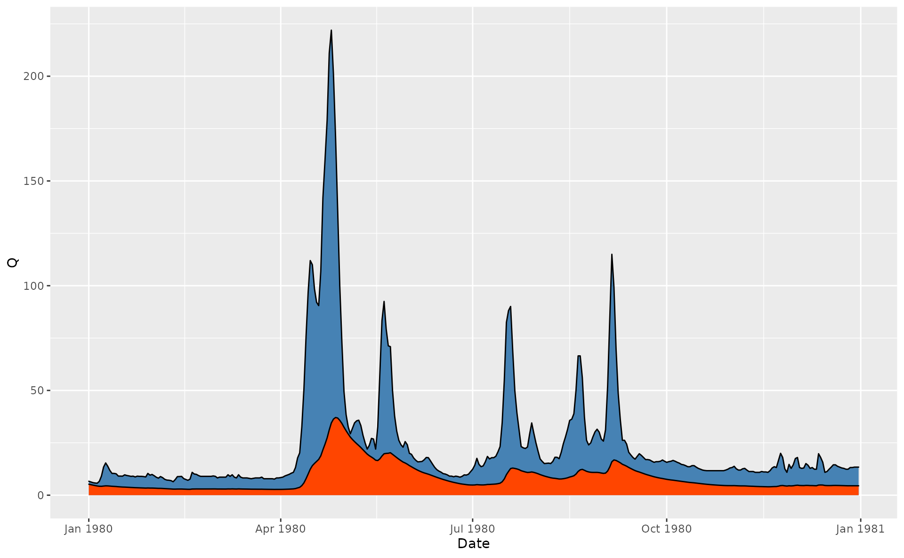
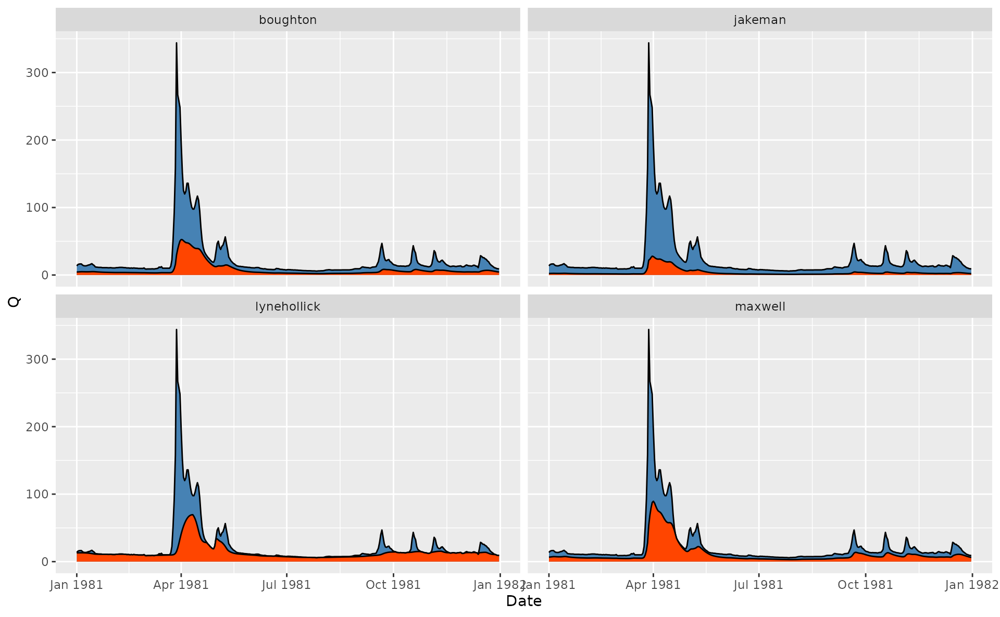
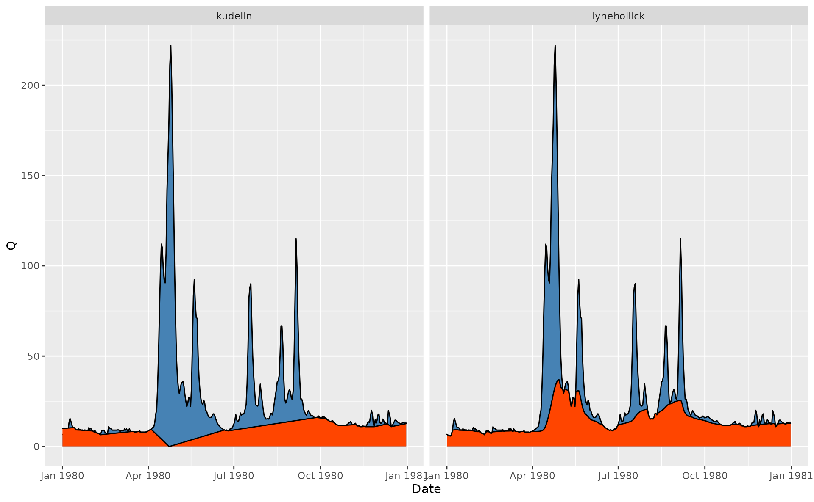

# 1. Baseflow filtering

``` r
library(grwat)
library(ggplot2)
library(dplyr)
library(tidyr)
library(lubridate)
```

**`grwat`** implements several methods for baseflow filtering, including
those by Lyne and Hollick (1979), Chapman (1991), Boughton (1993),
Jakeman and Hornberger (1993) and Chapman and Maxwell (1996). The
`get_baseflow()` function does the job:

``` r
Qbase = gr_baseflow(spas$Q, method = 'lynehollick', a = 0.925, passes = 3)
head(Qbase)
#> [1] 3.698598 3.789843 3.876099 3.958334 4.037031 4.112454
```

Though `get_baseflow()` needs just a vector of runoff values, it can be
applied in a traditional tidyverse pipeline like follows:

``` r
# Calculate baseflow using Jakeman approach
hdata = spas |> 
  mutate(Qbase = gr_baseflow(Q, method = 'jakeman'))

# Visualize for 2020 year
ggplot(hdata) +
  geom_area(aes(Date, Q), fill = 'steelblue', color = 'black') +
  geom_area(aes(Date, Qbase), fill = 'orangered', color = 'black') +
  scale_x_date(limits = c(ymd(19800101), ymd(19801231)))
#> Warning: Removed 23376 rows containing non-finite outside the scale range
#> (`stat_align()`).
#> Removed 23376 rows containing non-finite outside the scale range
#> (`stat_align()`).
```



Different methods can be compared in a similar way:

``` r
hdata = spas |>
  mutate(lynehollick = gr_baseflow(Q, method = 'lynehollick', a = 0.9),
         boughton = gr_baseflow(Q, method = 'boughton', k = 0.9),
         jakeman = gr_baseflow(Q, method = 'jakeman', k = 0.9),
         maxwell = gr_baseflow(Q, method = 'maxwell', k = 0.9)) |> 
  pivot_longer(lynehollick:maxwell, names_to = 'Method', values_to = 'Qbase')

ggplot(hdata) +
  geom_area(aes(Date, Q), fill = 'steelblue', color = 'black') +
  geom_area(aes(Date, Qbase), fill = 'orangered', color = 'black') +
  scale_x_date(limits = c(ymd(19810101), ymd(19811231))) +
  facet_wrap(~Method)
#> Warning: Removed 93508 rows containing non-finite outside the scale range
#> (`stat_align()`).
#> Removed 93508 rows containing non-finite outside the scale range
#> (`stat_align()`).
```



In case of 100% hydraulic connection between ground waters and river
discharge, according to Kudelin (1960) the baseflow is equal to zero
level at the point of maximum discharge during the spring flood event.
Since extraction of the spring flood requires meteorological data, it
cannot be extracted by simple filtering. Instead, you can use the
advanced separation method by Rets et al. (2022), which incorporates
Kudelin’s approach during the spring flood:

``` r
p = gr_get_params('center')
p$filter = 'kudelin'

hdata = spas |> 
  mutate(lynehollick = gr_baseflow(Q, method = 'lynehollick', 
                                   a = 0.925, passes = 3),
         kudelin = gr_separate(spas, p)$Qbase) |> 
  pivot_longer(lynehollick:kudelin, names_to = 'Method', values_to = 'Qbase')
#> grwat: data frame is correct
#> grwat: parameters list and types are OK

# Visualize for 1980 year
ggplot(hdata) +
  geom_area(aes(Date, Q), fill = 'steelblue', color = 'black') +
  geom_area(aes(Date, Qbase), fill = 'orangered', color = 'black') +
  scale_x_date(limits = c(ymd(19800101), ymd(19801231))) +
  facet_wrap(~Method)
#> Warning: Removed 46752 rows containing non-finite outside the scale range
#> (`stat_align()`).
#> Removed 46752 rows containing non-finite outside the scale range
#> (`stat_align()`).
```



## References

Boughton, W. C. 1993. “A Hydrograph-Based Model for Estimating Water
Yield of Ungauged Catchments.” In *Institute of Engineers Australia
National Conference*, 93/14:317–24.

Chapman, T. G. 1991. “Comment on “Evaluation of Automated Techniques for
Base Flow and Recession Analyses” by R. J. Nathan and T. A. McMahon.”
*Water Resources Research* 27 (7): 1783–84.

Chapman, T. G., and A. I. Maxwell. 1996. “Baseflow Separation -
Comparison of Numerical Methods with Tracer Experiments.” In *Hydrology
and Water Resources Symposium*, 539–45.

Jakeman, A. J., and G. M. Hornberger. 1993. “How Much Complexity Is
Warranted in a Rainfall-Runoff Model?” *Water Resources Research* 29
(8): 2637–49.

Kudelin, B. I. 1960. *Principles for Regional Assessment of Natural
Groundwater Resources \[in Russian: Принципы Региональной Оценки
Естественных Ресурсов Подземных Вод\]*. Moscow, Russia: Moscow State
University.

Lyne, V., and M. Hollick. 1979. “Stochastic Time-Variable
Rainfall-Runoff Modeling.” In *Australian National Conference
Publication*, 79:89–92.

Rets, E. P., M. B. Kireeva, T. E. Samsonov, N. N. Ezerova, A. V.
Gorbarenko, and N. L. Frolova. 2022. “Algorithm Grwat for Automated
Hydrograph Separation by B. I. Kudelin’s Method: Problems and
Perspectives.” *Water Resources* 49 (1): 23–37.
