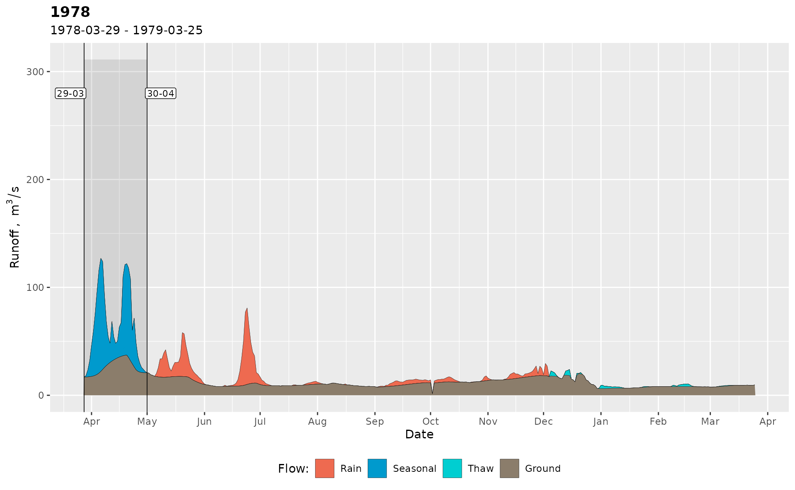
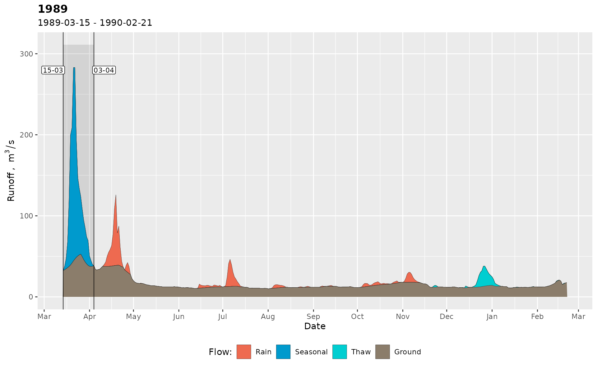
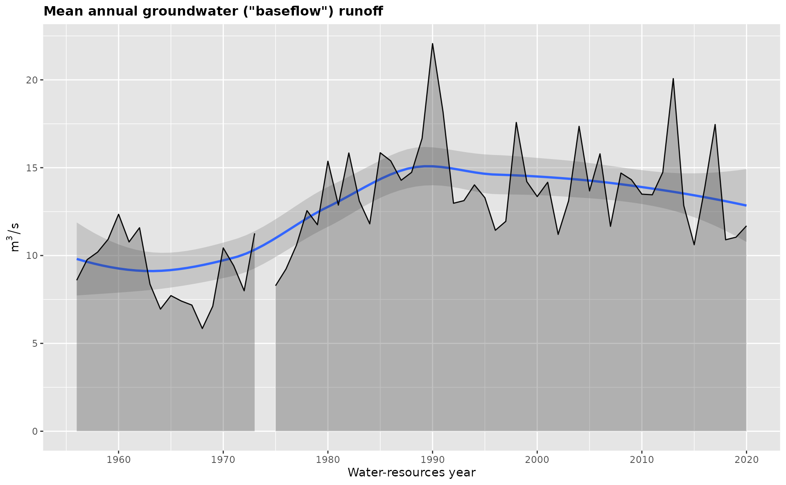
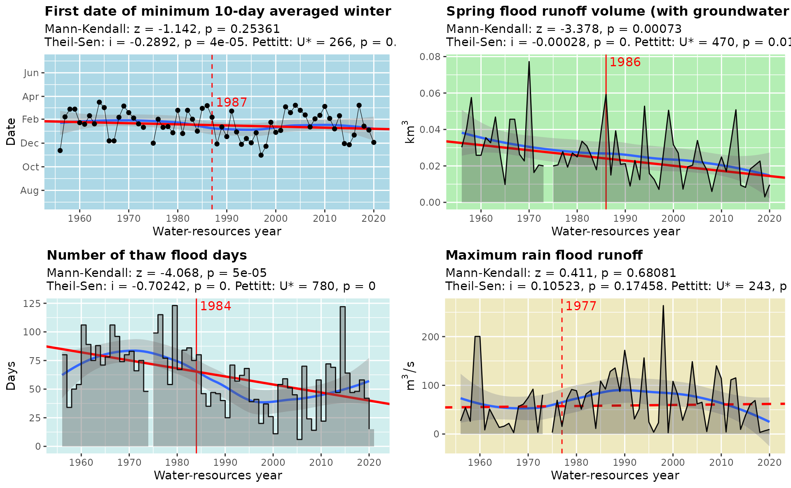

# Introduction to grwat R package

## Example data

Throughout **`grwat`** package documentation a sample dataset `spas`
containing the daily runoff data for
[Spas-Zagorye](https://allrivers.info/gauge/protva-obninsk) gauge on
[Protva](https://en.wikipedia.org/wiki/Protva) river in Central European
plane is used. The dataset is supplemented by meteorological variables
(temperature and precipitation) obtained from CIRES-DOE (1880-1949) and
ERA5 (1950-2021) data averaged inside gauge’s basin:

``` r
library(grwat)
library(dplyr)
library(ggplot2)
library(lubridate)

data(spas)
head(spas)
#> # A tibble: 6 × 4
#>   Date           Q   Temp  Prec
#>   <date>     <dbl>  <dbl> <dbl>
#> 1 1956-01-01  5.18  -6.46 0.453
#> 2 1956-01-02  5.18 -11.4  0.825
#> 3 1956-01-03  5.44 -10.7  0.26 
#> 4 1956-01-04  5.44  -8.05 0.397
#> 5 1956-01-05  5.44 -11.7  0.102
#> 6 1956-01-06  5.58 -20.1  0.032
```

This 4-column representation is standard for advanced separation
discussed below.

## Baseflow filtering

> For more information on baseflow filtering, read the [**Baseflow
> filtering**](https://tsamsonov.github.io/grwat/articles/baseflow.html)
> vignette.

**`grwat`** implements several methods for baseflow filtering. The
`get_baseflow()` function does the job:

``` r
Qbase = gr_baseflow(spas$Q, method = 'lynehollick', a = 0.925, passes = 3)
head(Qbase)
#> [1] 3.698598 3.789843 3.876099 3.958334 4.037031 4.112454
```

Though `get_baseflow()` needs just a vector of runoff values, it can be
applied in a traditional tidyverse pipeline like follows:

``` r
# Calculate baseflow using Jakeman approach
hdata = spas |> 
  mutate(Qbase = gr_baseflow(Q, method = 'jakeman'))

# Visualize for 2020 year
ggplot(hdata) +
  geom_area(aes(Date, Q), fill = 'steelblue', color = 'black') +
  geom_area(aes(Date, Qbase), fill = 'orangered', color = 'black') +
  scale_x_date(limits = c(ymd(19800101), ymd(19801231)))
#> Warning: Removed 23376 rows containing non-finite outside the scale range
#> (`stat_align()`).
#> Removed 23376 rows containing non-finite outside the scale range
#> (`stat_align()`).
```


## Advanced hydrograph separation

> For more information on advanced separation, read the [**Advanced
> separation**](https://tsamsonov.github.io/grwat/articles/separation.html)
> vignette.

Advanced separation by [`gr_separate()`](../reference/gr_separate.md)
implements the method by (Rets et al. 2022), which involves additional
data on temperatures and precipitation to detect and classify flood
events into the rain, thaw and spring (seasonal thaw). Between these
events $100\%$ of the runoff is considered to be ground. Inside those
events the ground flow is filtered either by one of the baseflow
functions, or by Kudelin’s method, which degrades baseflow to $0$ under
the maximum runoff value during the year.

The method is controlled by more than 20 parameters, which can be
region-specific. Therefore, to ease the management and distribution of
these parameters, they are organized as list, as returned by
[`gr_get_params()`](../reference/gr_get_params.md):

``` r
sep = gr_separate(spas, params = gr_get_params(reg = 'center'))
#> grwat: data frame is correct
#> grwat: parameters list and types are OK
head(sep)
#> # A tibble: 6 × 11
#>   Date           Q   Temp  Prec Qbase Quick Qspri Qrain Qthaw Season  Year
#>   <date>     <dbl>  <dbl> <dbl> <dbl> <dbl> <dbl> <dbl> <dbl>  <int> <int>
#> 1 1956-01-01  5.18  -6.46 0.453    NA    NA    NA    NA    NA     NA    NA
#> 2 1956-01-02  5.18 -11.4  0.825    NA    NA    NA    NA    NA     NA    NA
#> 3 1956-01-03  5.44 -10.7  0.26     NA    NA    NA    NA    NA     NA    NA
#> 4 1956-01-04  5.44  -8.05 0.397    NA    NA    NA    NA    NA     NA    NA
#> 5 1956-01-05  5.44 -11.7  0.102    NA    NA    NA    NA    NA     NA    NA
#> 6 1956-01-06  5.58 -20.1  0.032    NA    NA    NA    NA    NA     NA    NA
```

Resulting separation can be visualized by
[`gr_plot_sep()`](../reference/gr_plot_sep.md) function. In addition to
classification of the flow, the function shows the dates of the spring
seasonal flood:

``` r
gr_plot_sep(sep, years = c(1978, 1989))
```



## Summaries

> For more information on annual variables, read the
> [**Summaries**](https://tsamsonov.github.io/grwat/articles/summaries.html)
> vignette.

After hydrograph is separated, its characteristics can be summarized by
[`gr_summarize()`](../reference/gr_summarize.md) into annual variables
which characterize the annual runoff, its components (ground, spring,
rain and thaw) and low flow periods (summer and winter):

``` r
vars = gr_summarize(sep)
head(vars)
#> # A tibble: 6 × 57
#>    Year Year1 Year2 Dspstart   Dspend       Tsp    Qy Qspmax Dspmax      Qygr
#>   <dbl> <dbl> <dbl> <date>     <date>     <int> <dbl>  <dbl> <date>     <dbl>
#> 1  1956  1956  1957 1956-04-08 1956-05-05    27  18.4    467 1956-04-22  8.59
#> 2  1957  1957  1958 1957-03-25 1957-05-04    40  20.2    460 1957-04-08  9.77
#> 3  1958  1958  1959 1958-04-02 1958-05-13    41  27.3    537 1958-04-21 10.2 
#> 4  1959  1959  1960 1959-03-28 1959-04-28    31  27.1    406 1959-04-16 10.9 
#> 5  1960  1960  1961 1960-03-27 1960-04-27    31  29.6    406 1960-04-15 12.3 
#> 6  1961  1961  1962 1961-03-07 1961-05-02    56  18.8    296 1961-04-10 10.8 
#> # ℹ 47 more variables: Qsmin <dbl>, Dsmin <date>, Qwmin <dbl>, Dwmin <date>,
#> #   Q30s <dbl>, D30s1 <date>, D30s2 <date>, Q30w <dbl>, D30w1 <date>,
#> #   D30w2 <date>, Q10s <dbl>, D10s1 <date>, D10s2 <date>, Q10w <dbl>,
#> #   D10w1 <date>, D10w2 <date>, Q5s <dbl>, D5s1 <date>, D5s2 <date>, Q5w <dbl>,
#> #   D5w1 <date>, D5w2 <date>, Wy <dbl>, Wygr <dbl>, Wsp <dbl>, Wspgr <dbl>,
#> #   Wsprngr <dbl>, Wrn <dbl>, Wrngr <dbl>, Wth <dbl>, Wthgr <dbl>, Wgrs <dbl>,
#> #   Ws <dbl>, Wgrw <dbl>, Ww <dbl>, Qrnmax <dbl>, Qthmax <dbl>, …
```

These characteristics can be plotted by
[`gr_plot_vars()`](../reference/gr_plot_vars.md):

``` r
gr_plot_vars(vars, Qygr)
#> Warning: `aes_string()` was deprecated in ggplot2 3.0.0.
#> ℹ Please use tidy evaluation idioms with `aes()`.
#> ℹ See also `vignette("ggplot2-in-packages")` for more information.
#> ℹ The deprecated feature was likely used in the grwat package.
#>   Please report the issue at <https://github.com/tsamsonov/grwat/issues>.
#> This warning is displayed once every 8 hours.
#> Call `lifecycle::last_lifecycle_warnings()` to see where this warning was
#> generated.
#> Warning: Removed 1 row containing non-finite outside the scale range
#> (`stat_smooth()`).
#> Warning: Removed 1 row containing missing values or values outside the scale range
#> (`geom_ribbon()`).
```



``` r
gr_plot_vars(vars, D10w1, Wsprngr, Nthw, Qrnmax, tests = TRUE,
             layout = matrix(1:4, nrow = 2, byrow = TRUE)) 
#> Warning: Removed 1 row containing non-finite outside the scale range
#> (`stat_smooth()`).
#> Warning: Removed 1 row containing missing values or values outside the scale range
#> (`geom_point()`).
#> Warning: Removed 1 row containing non-finite outside the scale range
#> (`stat_smooth()`).
#> Warning: Removed 1 row containing missing values or values outside the scale range
#> (`geom_ribbon()`).
#> Warning: Removed 1 row containing non-finite outside the scale range (`stat_smooth()`).
#> Removed 1 row containing non-finite outside the scale range (`stat_smooth()`).
#> Warning: Removed 1 row containing missing values or values outside the scale range
#> (`geom_ribbon()`).
```



## Additional features

**`grwat`** contains some useful functions that can facilitate your work
with runoff data. In particular:

- [`gr_report()`](../reference/gr_report.md) aggregates hydrograph
  separation and its summaries into one information-rich graphical
  report that brings everything into one place. Just pass the results of
  [`gr_separate()`](../reference/gr_separate.md) and
  [`gr_summarize()`](../reference/gr_summarize.md) into
  [`gr_report()`](../reference/gr_report.md) function and provide the
  path to the output `HTML` file.

- [`gr_get_gaps()`](../reference/gr_get_gaps.md) and
  [`gr_fill_gaps()`](../reference/gr_fill_gaps.md) find and interpolate
  the periods of missing runoff and meteorological data which may affect
  the results.

- [`gr_read_rean()`](../reference/gr_read_rean.md) and
  [`gr_join_rean()`](../reference/gr_join_rean.md) add temperature and
  precipitation to your runoff data from daily reanalysis. This can be
  useful if you do not have meteorological observations inside the
  basin. Currently the East European plain is covered.

- [`gr_plot_matrix()`](../reference/gr_plot_matrix.md),
  [`gr_plot_hori()`](../reference/gr_plot_hori.md) and
  [`gr_plot_ridge()`](../reference/gr_plot_ridge.md) empower daily
  runoff analysis with fascinating graphical techniques which can be
  used to compare hydrographs for different years: matrix plots, horizon
  plots and ridgeline plots.

- [`gr_set_locale()`](../reference/gr_set_locale.md) translates plots
  and reports to the specified language (English, Russian and Ukrainian
  are currently available).

- `gr_plot_*` functions return silently
  [`ggplot2`](https://ggplot2.tidyverse.org) objects or the lists of
  such objects. This means that they can be modified to your preferences
  before plotting. Just set `print = FALSE` and tweak aesthetics as you
  want or remove some information.

## References

Rets, E. P., M. B. Kireeva, T. E. Samsonov, N. N. Ezerova, A. V.
Gorbarenko, and N. L. Frolova. 2022. “Algorithm Grwat for Automated
Hydrograph Separation by B. I. Kudelin’s Method: Problems and
Perspectives.” *Water Resources* 49 (1): 23–37.
