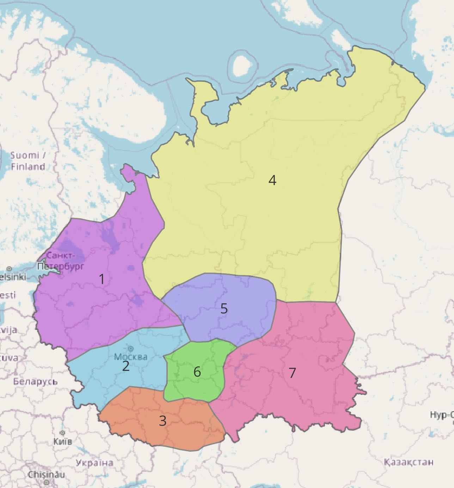
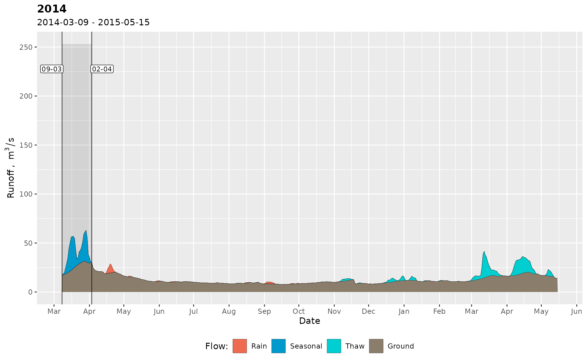
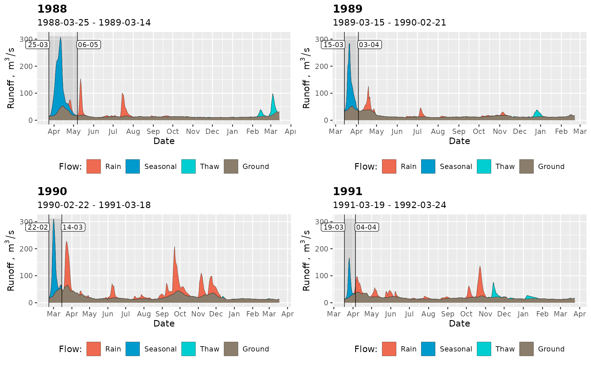
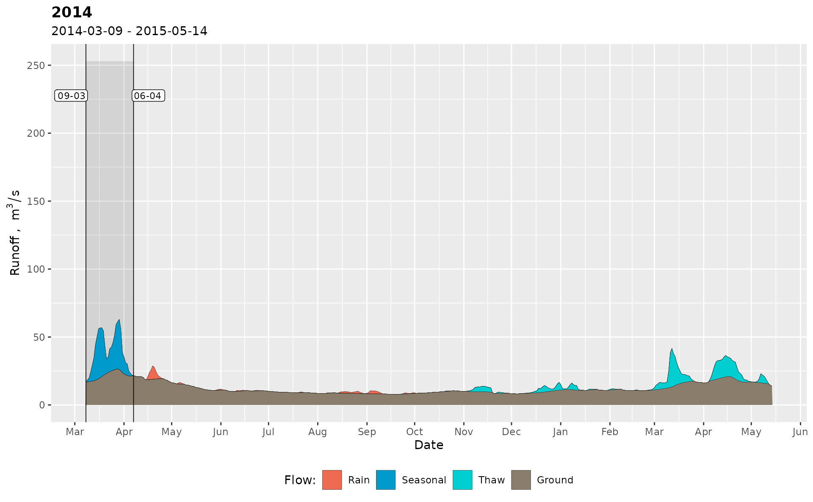
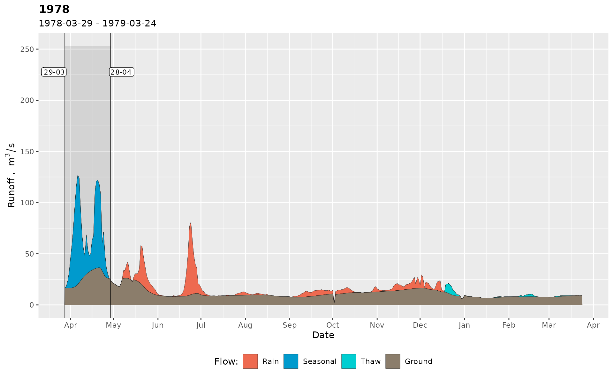

# 2. Advanced hydrograph separation

## Introduction

The core of the *`grwat`* package is the advanced hydrograph separation
method by Rets et al. (2022), which utilizes supplementary temperature
and precipitation data to classify quickflow events by their genesis.
The genetic types are rain, thaw and spring. The latter is a specific
kind of thaw flood (sometimes called a *freshet*) that appears in cold
climates at the beginning of the spring during the massive snow melting
in a watershed. It is not uncommon that a spring flood is significantly
larger than others during the year, and produces the major part of the
annual runoff volume.

Throughout **`grwat`** package documentation a sample dataset `spas`
containing the daily runoff data for
[Spas-Zagorye](https://allrivers.info/gauge/protva-obninsk) gauge on
[Protva](https://en.wikipedia.org/wiki/Protva) river in Central European
plane is used. The dataset is supplemented by meteorological variables
(temperature and precipitation) obtained from CIRES-DOE (1880-1949) and
ERA5 (1950-2021) data averaged inside gauge’s basin:

``` r
library(grwat)
data(spas) # example Spas-Zagorye data is included with grwat package
head(spas)
#>         Date    Q   Temp  Prec
#> 1 1956-01-01 5.18  -6.46 0.453
#> 2 1956-01-02 5.18 -11.41 0.825
#> 3 1956-01-03 5.44 -10.74 0.260
#> 4 1956-01-04 5.44  -8.05 0.397
#> 5 1956-01-05 5.44 -11.73 0.102
#> 6 1956-01-06 5.58 -20.13 0.032
```

> This 4-column representation of the date, runoff, temperature and
> precipitation is a standardized form of a data frame required for
> advanced separation

## Separation basics

Advanced separation is a formal analytical procedure that is performed
in several stages (Rets et al. 2022):

A. Identify the start dates of water resources years. The start date is
the first day of the spring flood.

B. For each water-resources year:

1.  Separate quickflow and baseflow. Identify the end date of the spring
    flood as the first day after the start without quickflow.
2.  Calculate the long periods of significant precipitation and low
    temperatures.
3.  Identify second-order rain floods during the spring flood.
4.  Calculate the first day of winter season.
5.  Attribute all quickflow between the last day of spring flood and the
    first day of winter season as the rain flow.
6.  Attribute all quickflow between the first day of winter and the last
    day of water-resources year as the thaw flow.

This algorithm is executed by
[`gr_separate()`](../reference/gr_separate.md) function, which requires
a 4-column data frame as specified earlier, and the list of parameters.
The number parameters is quite big ($39$ for the current version of the
package), and the parameters depend on the regional climate and the size
of the river basin. Currently the recommended parameters are available
for some regions in the center of the East European Plane. You can use
them as the starting point for experimentation. The regions are:

1.  `northwest`
2.  `center`
3.  `south`
4.  `northeast`
5.  `volga`
6.  `oka`
7.  `southeast`



To ease the exchange of the parameters, they are organized as list, as
returned by [`gr_get_params()`](../reference/gr_get_params.md). You can
pass either the number of region, or its name in `reg` argument:

``` r
params = gr_get_params(reg = 'south')
head(params)
#> $winmon
#> [1] 11
#> 
#> $grad1
#> [1] 2
#> 
#> $grad2
#> [1] 5
#> 
#> $gratio
#> [1] 350
#> 
#> $spmon1
#> [1] 3
#> 
#> $spmon2
#> [1] 5

params = gr_get_params(reg = 2)
head(params)
#> $winmon
#> [1] 11
#> 
#> $grad1
#> [1] 1.7
#> 
#> $grad2
#> [1] 5
#> 
#> $gratio
#> [1] 400
#> 
#> $spmon1
#> [1] 2
#> 
#> $spmon2
#> [1] 5
```

To ease the understanding of the parameters, grwat contains the helper
[`gr_help_params()`](../reference/gr_help_params.md) function, which
describes the meaning of each:

``` r
gr_help_params()
#> # A tibble: 39 × 12
#>        N name_old name       example desc  units formula comments pics  desc_rus
#>    <dbl> <chr>    <chr>      <chr>   <chr> <chr> <chr>   <chr>    <lgl> <chr>   
#>  1     1 mome     winmon     11      the … month  NA     "not us… NA    месяц, …
#>  2     2 grad     grad1      1.5     rate… %      NA     "if cha… NA    интенси…
#>  3     3 grad1    grad2      2       rate… %     "\"\""  "\"\""   NA    интенси…
#>  4     4 kdQgr1   gratio     150     maxi… %      NA     "can be… NA    максима…
#>  5     5 polmon1  spmon1     2       the … month  NA     "can be… NA    cамый р…
#>  6     6 polmon2  spmon2     5       the … month  NA     "can be… NA    самый п…
#>  7     7 polkol1  sptriseda… 15      amou… days   NA      NA      NA    количес…
#>  8     8 polkol2  spriseday… 25      amou… days   NA      NA      NA    количес…
#>  9     9 polkol3  spdays     30      amou… days   NA     "can be… NA    количес…
#> 10    10 polgrad1 sprise     10      mean… %      NA      NA      NA    значени…
#> # ℹ 29 more rows
#> # ℹ 2 more variables: role_1 <chr>, role_2 <chr>
```

You can tweak the parameters just by changing their values in the list:

``` r
params$sprise = 12
params$gratio = 500
```

It is quite hard to predict how effective will be parameters for the
particular basin. Therefore, the search for optimal values is
experimental work. After a preliminary parameters are set, you can
separate the hydrograph by
[`gr_separate()`](../reference/gr_separate.md):

``` r
# separate
sep = gr_separate(spas, params)
#> grwat: data frame is correct
#> grwat: parameters list and types are OK
head(sep)
#> # A tibble: 6 × 11
#>   Date           Q   Temp  Prec Qbase Quick Qspri Qrain Qthaw Season  Year
#>   <date>     <dbl>  <dbl> <dbl> <dbl> <dbl> <dbl> <dbl> <dbl>  <int> <int>
#> 1 1956-01-01  5.18  -6.46 0.453    NA    NA    NA    NA    NA     NA    NA
#> 2 1956-01-02  5.18 -11.4  0.825    NA    NA    NA    NA    NA     NA    NA
#> 3 1956-01-03  5.44 -10.7  0.26     NA    NA    NA    NA    NA     NA    NA
#> 4 1956-01-04  5.44  -8.05 0.397    NA    NA    NA    NA    NA     NA    NA
#> 5 1956-01-05  5.44 -11.7  0.102    NA    NA    NA    NA    NA     NA    NA
#> 6 1956-01-06  5.58 -20.1  0.032    NA    NA    NA    NA    NA     NA    NA
```

Resulting data frame is enriched with information about different kinds
of flow. To evaluate the results, you can use separation plots provided
by [`gr_plot_sep()`](../reference/gr_plot_sep.md):

``` r
# One year
gr_plot_sep(sep, 1978) 
```


    #> Plotting separation ■■■■■■■■■■■■■■■■                  50% | ETA:  1s
    #> Plotting separation ■■■■■■■■■■■■■■■■■■■■■■■■■■■■■■■  100% | ETA:  0s

    # Two years
    gr_plot_sep(sep, c(1978, 2014)) 



``` r

# Four years in a matrix layout
gr_plot_sep(sep, 1988:1991, layout = matrix(1:4, nrow = 2, byrow = TRUE)) 
```



## Tweaking of the parameters

Sometimes global parameters do not work, and you need to tweak the
values for selected years. For this you use a `list` of parameter
`list`s instead of the one list. In such case the number of parameter
`list`s must be equal to the number of water-resources years in a runoff
data. Instead of constructing such list manually, you can use
[`gr_separate()`](../reference/gr_separate.md) in `debug = TRUE` mode.
If this mode is activated, grwat will return two additional attributes:

- `jittered` attribute shows the years for which grwat tweaked some
  parameters because it was unable to identify the beginning of
  water-resources year based ion global parameters;
- `params` attribute contains a `list` of parameter `list`s used for
  each year (including those that were jittered).

The attributes are extracted via a base R function
[`attributes()`](https://rdrr.io/r/base/attributes.html):

``` r
# Debug mode gives access to additional information
sep_debug = gr_separate(spas, 
                        params = gr_get_params(reg = 'center'), 
                        debug = TRUE)
#> grwat: data frame is correct
#> grwat: parameters list and types are OK
#> Warning in gr_separate(spas, params = gr_get_params(reg = "center"), debug =
#> TRUE): grwat: 1974 years were not separated. Check the input data
#> for possible errors. Use gr_get_gaps() and gr_fill_gaps()
#> functions to detect and fill missing data.
#> Warning in gr_separate(spas, params = gr_get_params(reg = "center"), debug =
#> TRUE): grwat: 2002, 2014, 2019 years were processed with jittered
#> parameters

# a vector of years with jittered params
jit = attributes(sep_debug)$jittered
print(jit)
#> [1] 2002 2014 2019

# actual params used for each year
parlist = attributes(sep_debug)$params
partab = do.call(dplyr::bind_rows, parlist) # View as table
head(partab)
#> # A tibble: 6 × 39
#>   winmon grad1 grad2 gratio spmon1 spmon2 sprisedays1 sprisedays2 spdays sprise
#>    <dbl> <dbl> <dbl>  <dbl>  <dbl>  <dbl>       <dbl>       <dbl>  <dbl>  <dbl>
#> 1     11   1.7     5    400      2      5           8          10     30     10
#> 2     11   1.7     5    400      2      5           8          10     30     10
#> 3     11   1.7     5    400      2      5           8          10     30     10
#> 4     11   1.7     5    400      2      5           8          10     30     10
#> 5     11   1.7     5    400      2      5           8          10     30     10
#> 6     11   1.7     5    400      2      5           8          10     30     10
#> # ℹ 29 more variables: spratio <dbl>, sprecdays <dbl>, spcomp <dbl>,
#> #   precdays <dbl>, frostdays <dbl>, windays <dbl>, floodprec <dbl>,
#> #   floodtemp <dbl>, frosttemp <dbl>, wintemp <dbl>, signratio1 <dbl>,
#> #   signratio2 <dbl>, floodratio <dbl>, gaplen <dbl>, snowtemp <dbl>,
#> #   gradabs <dbl>, mntmode <dbl>, mntgrad <dbl>, mntavgdays <dbl>,
#> #   mntratiodays <dbl>, mntratio <dbl>, niter <dbl>, a <dbl>, k <dbl>, C <dbl>,
#> #   aq <dbl>, padding <dbl>, passes <dbl>, filter <chr>
```

After the list of parameters is extracted, any of those can be
referenced by the character string of the water-resources year. For
example, if you want to apply the parameters of one tweaked your
globally, the following will work:

``` r
# extract and tweak parameters for selected year
p = parlist[['2014']]
p$grad1 = 1
p$grad2 = 2.5

# use tweaked parameters for all years
sep_debug = gr_separate(spas, params = p, debug = TRUE)
#> grwat: data frame is correct
#> grwat: parameters list and types are OK
#> Warning in gr_separate(spas, params = p, debug = TRUE): grwat:
#> 1974 years were not separated. Check the input data for possible errors.
#> Use gr_get_gaps() and gr_fill_gaps() functions to detect and fill
#> missing data.
#> Warning in gr_separate(spas, params = p, debug = TRUE): grwat: 2002,
#> 2019 years were processed with jittered parameters

# Visualize
gr_plot_sep(sep_debug, c(1978, 2014)) 
```



However, the most powerful strategy is to keep the nested list structure
and change the parameters individually for different years. If you want
to set some parameter for multiple years, then use
[`gr_set_param()`](../reference/gr_set_param.md):

``` r
# actual params used for each year
parlist = attributes(sep_debug)$params

# tweak parameters for selected year
parlist[['2014']]$grad1 = 3
parlist[['2014']]$grad2 = 6

# set the sprecdays parameter for multiple years
parlist = gr_set_param(parlist, sprecdays, 
                       years = c(1978, 1999:2015), 
                       value = 15)

# set the spcomp parameter for all years
parlist = gr_set_param(parlist, spcomp, value = 2.5)

# use the list of parameters for separation
sep_debug = gr_separate(spas, params = parlist, debug = TRUE)
#> grwat: data frame is correct
#> grwat: parameters list and types are OK
#> Warning in gr_separate(spas, params = parlist, debug = TRUE): grwat:
#> 1974 years were not separated. Check the input data for possible errors.
#> Use gr_get_gaps() and gr_fill_gaps() functions to detect and fill
#> missing data.

# Visualize
gr_plot_sep(sep_debug, c(1978, 2014))
```



## References

Rets, E. P., M. B. Kireeva, T. E. Samsonov, N. N. Ezerova, A. V.
Gorbarenko, and N. L. Frolova. 2022. “Algorithm Grwat for Automated
Hydrograph Separation by B. I. Kudelin’s Method: Problems and
Perspectives.” *Water Resources* 49 (1): 23–37.
