# 3. Summaries

## Introduction

Annual variables are useful statistics calculated for the results of
hydrograph separation. While separation is performed on a daily basis,
the summaries calculated by *`grwat`* are annual. Examples are maximum
spring flood runoff, mean annual groundwater (“baseflow”) runoff, thaw
flood runoff volume (w/o groundwater) or the number of rain flood days.
Users proficient in R can calculate such variables simply by summarizing
the results of [`gr_separate()`](../reference/gr_separate.md) function.
However, summarizing functionality is implemented in the package for a
more streamlined analysis. The benefits are that the standardized
variables can be supplemented by additional functions that perform their
statistical testing and plotting.

First of all, we need to separate the hydrograph:

``` r
library(grwat)
data(spas) # example Spas-Zagorye data is included with grwat package
head(spas) # separate
#>         Date    Q   Temp  Prec
#> 1 1956-01-01 5.18  -6.46 0.453
#> 2 1956-01-02 5.18 -11.41 0.825
#> 3 1956-01-03 5.44 -10.74 0.260
#> 4 1956-01-04 5.44  -8.05 0.397
#> 5 1956-01-05 5.44 -11.73 0.102
#> 6 1956-01-06 5.58 -20.13 0.032
sep = gr_separate(spas, params = gr_get_params(reg = 'center'))
```

> For more information on advanced separation, read the [**Advanced
> separation**](https://tsamsonov.github.io/grwat/articles/separation.html)
> vignette.

After that we can use [`gr_summarize()`](../reference/gr_summarize.md)
to summarize the result:

``` r
# summarize
vars = gr_summarize(sep)
#> Warning: There were 2 warnings in `dplyr::summarise()`.
#> The first warning was:
#> ℹ In argument: `Dspstart = min(.data$Date[which(.data$Qspri > 0)])`.
#> ℹ In group 19: `Year1 = 1974`.
#> Caused by warning in `min.default()`:
#> ! no non-missing arguments to min; returning Inf
#> ℹ Run `dplyr::last_dplyr_warnings()` to see the 1 remaining warning.
#> Warning: There was 1 warning in `dplyr::summarise()`.
#> ℹ In argument: `Q30w = condrollmean(.data$Q, .data$Season == 2, 30)`.
#> ℹ In group 64: `Year = 2020`.
#> Caused by warning in `min()`:
#> ! no non-missing arguments to min; returning Inf

head(vars)
#> # A tibble: 6 × 57
#>    Year Year1 Year2 Dspstart   Dspend       Tsp    Qy Qspmax Dspmax      Qygr
#>   <dbl> <dbl> <dbl> <date>     <date>     <int> <dbl>  <dbl> <date>     <dbl>
#> 1  1956  1956  1957 1956-04-08 1956-05-05    27  18.4    467 1956-04-22  8.59
#> 2  1957  1957  1958 1957-03-25 1957-05-04    40  20.2    460 1957-04-08  9.77
#> 3  1958  1958  1959 1958-04-02 1958-05-13    41  27.3    537 1958-04-21 10.2 
#> 4  1959  1959  1960 1959-03-28 1959-04-28    31  27.1    406 1959-04-16 10.9 
#> 5  1960  1960  1961 1960-03-27 1960-04-27    31  29.6    406 1960-04-15 12.3 
#> 6  1961  1961  1962 1961-03-07 1961-05-02    56  18.8    296 1961-04-10 10.8 
#> # ℹ 47 more variables: Qsmin <dbl>, Dsmin <date>, Qwmin <dbl>, Dwmin <date>,
#> #   Q30s <dbl>, D30s1 <date>, D30s2 <date>, Q30w <dbl>, D30w1 <date>,
#> #   D30w2 <date>, Q10s <dbl>, D10s1 <date>, D10s2 <date>, Q10w <dbl>,
#> #   D10w1 <date>, D10w2 <date>, Q5s <dbl>, D5s1 <date>, D5s2 <date>, Q5w <dbl>,
#> #   D5w1 <date>, D5w2 <date>, Wy <dbl>, Wygr <dbl>, Wsp <dbl>, Wspgr <dbl>,
#> #   Wsprngr <dbl>, Wrn <dbl>, Wrngr <dbl>, Wth <dbl>, Wthgr <dbl>, Wgrs <dbl>,
#> #   Ws <dbl>, Wgrw <dbl>, Ww <dbl>, Qrnmax <dbl>, Qthmax <dbl>, …
```

Resulting data frame contains more than 50 variables that can be used in
the analysis of interannual changes. To get familiar with the variables
and their names, just use the
[`gr_help_vars()`](../reference/gr_help_vars.md) function:

``` r
gr_help_vars()
#> # A tibble: 57 × 21
#>       ID Position Width Source Name_old    Name   Units Unitsua Unitsen Readtype
#>    <dbl>    <dbl> <dbl>  <dbl> <chr>       <chr>  <chr> <chr>   <chr>   <chr>   
#>  1     1        1     7      1 year_number Number NA    NA      NA      integer 
#>  2     2        8    10      1 Year1       Year1  Год   Рок     Year    integer 
#>  3     3       18    10      1 Year2       Year2  Год   Рок     Year    integer 
#>  4     4       28    15      1 datestart   Dspst… Дата  Дата    Date    Date    
#>  5     5       43    15      1 datepolend  Dspend Дата  Дата    Date    Date    
#>  6    57        0     0      0 PolProd     Tsp    Дней  Дней    Days    integer 
#>  7     6       58    10      1 Qy          Qy     м^3/с м^3/с   m^3/s   double  
#>  8     7       68    10      1 Qmax        Qspmax м^3/с м^3/с   m^3/s   double  
#>  9     8       78    15      1 datemax     Dspmax Дата  Дата    Date    Date    
#> 10     9       93    10      1 Qygr        Qygr   м^3/с м^3/с   m^3/s   double  
#> # ℹ 47 more rows
#> # ℹ 11 more variables: Type <chr>, Test <dbl>, Desc <chr>, Descua <chr>,
#> #   Descen <chr>, Group <chr>, Winter <dbl>, Chart <chr>, Color <chr>,
#> #   Order <dbl>, Range <chr>
```

## Statistical tests

Variable testing by [`gr_test_vars()`](../reference/gr_test_vars.md) can
be used to estimate the statistical significance of the interannual
changes. Pettitt test is performed to detect the change year — i.e. the
year which divides the time series into the statistically most differing
samples. Student (Welch) and Fisher tests are used to estimate the
significance of mean and variance differences of these samples.
Theil-Sen test calculates the trend slope value. Mann-Kendall test is
performed to reveal the significance of the trend.
[`gr_test_vars()`](../reference/gr_test_vars.md) returns the list of
tests for each variable:

``` r
# test all variables
tests = gr_test_vars(vars)

# view Pettitt test for Qygr
tests$ptt$Qygr
#> 
#>  Pettitt's test for single change-point detection
#> 
#> data:  vl[vl_cmp]
#> U* = 869, p-value = 8.129e-08
#> alternative hypothesis: two.sided
#> sample estimates:
#> probable change point at time K 
#>                              23

# view Fisher test for Q30s
tests$ft$Q30s
#> 
#>  F test to compare two variances
#> 
#> data:  d1 and d2
#> F = 0.53023, num df = 21, denom df = 41, p-value = 0.1208
#> alternative hypothesis: true ratio of variances is not equal to 1
#> 95 percent confidence interval:
#>  0.2597352 1.1887012
#> sample estimates:
#> ratio of variances 
#>          0.5302307

# test only Qygr and Q30s using 1978 as fixed year and excluding 1988-1991 yrs
gr_test_vars(vars, Qygr, year = 1979, exclude = 1988:1991)
#> $ptt
#> $ptt$Qygr
#> 
#>  Pettitt's test for single change-point detection
#> 
#> data:  vl[vl_cmp]
#> U* = 777, p-value = 1.372e-07
#> alternative hypothesis: two.sided
#> sample estimates:
#> probable change point at time K 
#>                              23 
#> 
#> 
#> 
#> $mkt
#> $mkt$Qygr
#> 
#>  Mann-Kendall trend test
#> 
#> data:  vl[vl_cmp]
#> z = 4.6495, n = 60, p-value = 3.327e-06
#> alternative hypothesis: true S is not equal to 0
#> sample estimates:
#>            S         varS          tau 
#> 7.300000e+02 2.458333e+04 4.124294e-01 
#> 
#> 
#> 
#> $tst
#> $tst$Qygr
#> 
#>  Sen's slope
#> 
#> data:  df.theil[[2]][fltr]
#> z = 4.6495, n = 60, p-value = 3.327e-06
#> alternative hypothesis: true z is not equal to 0
#> 95 percent confidence interval:
#>  0.06226163 0.13936618
#> sample estimates:
#> Sen's slope 
#>  0.09737272 
#> 
#> 
#> 
#> $ts_fit
#> $ts_fit$Qygr
#> 
#> Call:
#> mblm::mblm(formula = eval(frml), dataframe = df.theil[fltr, ], 
#>     repeated = FALSE)
#> 
#> Coefficients:
#> (Intercept)        Year1  
#>  -161.12007      0.08728  
#> 
#> 
#> 
#> $tt
#> $tt$Qygr
#> 
#>  Welch Two Sample t-test
#> 
#> data:  d1 and d2
#> t = -8.5316, df = 47.976, p-value = 3.519e-11
#> alternative hypothesis: true difference in means is not equal to 0
#> 95 percent confidence interval:
#>  -5.557367 -3.437530
#> sample estimates:
#> mean of x mean of y 
#>  9.296712 13.794160 
#> 
#> 
#> 
#> $ft
#> $ft$Qygr
#> 
#>  F test to compare two variances
#> 
#> data:  d1 and d2
#> F = 0.80528, num df = 21, denom df = 37, p-value = 0.6073
#> alternative hypothesis: true ratio of variances is not equal to 1
#> 95 percent confidence interval:
#>  0.3869063 1.8213188
#> sample estimates:
#> ratio of variances 
#>           0.805275 
#> 
#> 
#> 
#> $year
#> Qygr 
#> 1979 
#> 
#> $maxval
#> $maxval$Qygr
#> [1] 20.05682
#> 
#> 
#> $fixed_year
#> [1] TRUE
#> 
#> $pvalues
#>   N                                    Variable Change.Year   Trend      M1
#> 1 1 Mean annual groundwater ("baseflow") runoff        1979 0.08728 9.29671
#>         M2 MeanRatio     sd1     sd2 sdRatio Mann.Kendall Pettitt Student
#> 1 13.79416      48.4 1.88588 2.10156    11.4            0       0       0
#>    Fisher
#> 1 0.60734
```

The tests can be represented in a clear tabular form for visual
analysis:

``` r
gr_kable_tests(tests)
```

|   N | Variable                                                   | Change.Year | Trend    | M1        | M2        | MeanRatio |       sd1 |       sd2 | sdRatio | Mann.Kendall | Pettitt | Student | Fisher  |
|----:|:-----------------------------------------------------------|------------:|:---------|:----------|:----------|:----------|----------:|----------:|:--------|:-------------|:--------|:--------|:--------|
|   1 | Annual runoff volume                                       |        1978 | 2e-05    | 0.06173   | 0.07133   | 15.6      |   0.01713 |   0.02190 | 27.8    | 0.90316      | 0.42579 | 0.06147 | 0.23796 |
|   2 | Spring flood runoff volume (w/o groundwater)               |        1986 | -0.00026 | 0.02293   | 0.01514   | -34       |   0.01204 |   0.01083 | -10     | 9e-05        | 0.00596 | 0.00923 | 0.55265 |
|   3 | Annual groundwater runoff volume                           |        1979 | 3e-04    | 0.02919   | 0.04467   | 53        |   0.00583 |   0.00917 | 57.3    | 2e-05        | 0       | 0       | 0.02858 |
|   4 | Spring flood runoff volume (with groundwater)              |        1988 | -0.00025 | 0.03009   | 0.0208    | -30.9     |   0.01439 |   0.01223 | -15     | 0.00069      | 0.01499 | 0.00744 | 0.36779 |
|   5 | Rain flood runoff volume (w/o groundwater)                 |        1975 | 0        | 0.00571   | 0.00877   | 53.6      |   0.00685 |   0.00860 | 25.5    | 0.97689      | 0.66529 | 0.14526 | 0.30919 |
|   6 | Rain flood runoff volume (with groundwater)                |        1977 | 4e-05    | 0.01413   | 0.02377   | 68.2      |   0.01045 |   0.01585 | 51.7    | 0.52016      | 0.09611 | 0.00564 | 0.05192 |
|   7 | Thaw flood runoff volume (w/o groundwater)                 |        1983 | -1e-05   | 0.00254   | 0.00204   | -19.7     |   0.00305 |   0.00252 | -17.4   | 0.3944       | 0.45143 | 0.50109 | 0.28875 |
|   8 | Thaw flood runoff volume (with groundwater)                |        2010 | 0        | 0.00749   | 0.00909   | 21.4      |   0.00495 |   0.00587 | 18.6    | 0.8757       | 1       | 0.41462 | 0.40826 |
|   9 | Winter groundwater runoff volume                           |        1978 | 9e-05    | 0.00742   | 0.01189   | 60.2      |   0.00238 |   0.00344 | 44.5    | 0.00017      | 1e-05   | 0       | 0.07751 |
|  10 | Winter low flow runoff volume                              |        1978 | 7e-05    | 0.00953   | 0.01351   | 41.8      |   0.00492 |   0.00501 | 1.8     | 0.01472      | 0.00102 | 0.00444 | 0.96188 |
|  11 | Summer groundwater runoff volume                           |        1979 | 2e-04    | 0.01474   | 0.02497   | 69.4      |   0.00451 |   0.00703 | 55.9    | 1e-05        | 0       | 0       | 0.03202 |
|  12 | Summer low flow runoff volume                              |        1977 | 0.00022  | 0.01917   | 0.03262   | 70.2      |   0.01064 |   0.01469 | 38.1    | 0.01337      | 0.00175 | 0.00013 | 0.12912 |
|  13 | Mean annual runoff                                         |        1978 | 0.00065  | 19.69591  | 22.67237  | 15.1      |   5.69050 |   6.75029 | 18.6    | 0.98613      | 0.47808 | 0.07137 | 0.41412 |
|  14 | First date of a spring flood                               |        1970 | -0.16036 | 28-Mar    | 17-Mar    | -11       |   8.00000 |  15.00000 | 87.5    | 0.09605      | 0.10956 | 0.00295 | 0.02529 |
|  15 | Mean annual groundwater (“baseflow”) runoff                |        1979 | 0.08862  | 9.29671   | 14.18604  | 52.6      |   1.88588 |   2.48722 | 31.9    | 1e-05        | 0       | 0       | 0.17496 |
|  16 | Last date of a spring flood                                |        1970 | -0.26393 | 05-May    | 22-Apr    | -13       |   6.00000 |  16.00000 | 166.7   | 0.00261      | 0.00569 | 1e-05   | 4e-04   |
|  17 | Duration of a spring flood                                 |        1989 | -0.1467  | 38.0625   | 33.78125  | -11.2     |   7.33061 |  12.97077 | 76.9    | 0.01739      | 0.02757 | 0.11047 | 0.00212 |
|  18 | Maximum spring flood runoff                                |        1970 | -4       | 419.78571 | 241.83    | -42.4     | 162.94462 | 146.00771 | -10.4   | 8e-05        | 0.01088 | 0.00152 | 0.55597 |
|  19 | Date of a maximum spring flood runoff                      |        1970 | -0.08333 | 14-Apr    | 14-Apr    | 0         |   5.00000 |  40.00000 | 700     | 0.24607      | 0.19331 | 0.93    | 0       |
|  20 | Spring flood runoff volume (with groundwater and rain)     |        1986 | -0.00028 | 0.03074   | 0.02251   | -26.8     |   0.01391 |   0.01415 | 1.7     | 0.00073      | 0.01377 | 0.02274 | 0.93649 |
|  21 | Minimum daily winter runoff                                |        1979 | 0.1206   | 4.05591   | 9.42833   | 132.5     |   1.93119 |   2.03176 | 5.2     | 0            | 0       | 0       | 0.8237  |
|  22 | Date of minimum daily winter runoff                        |        1965 | -0.19677 | 16-Feb    | 19-Jan    | -28       |  43.00000 |  35.00000 | -18.6   | 0.41054      | 0.36833 | 0.10043 | 0.32859 |
|  23 | Minimum daily summer runoff                                |        1979 | 0.05578  | 4.49091   | 8.35571   | 86.1      |   2.19461 |   1.80075 | -17.9   | 0.00205      | 0       | 0       | 0.27404 |
|  24 | Date of minimum daily summer runoff                        |        2000 | 0.33333  | 23-Jul    | 15-Aug    | 23        |  34.00000 |  31.00000 | -8.8    | 0.1962       | 0.05942 | 0.01235 | 0.74221 |
|  25 | Minimum 30-day averaged winter runoff                      |        1979 | 0.10931  | 6.00123   | 11.19472  | 86.5      |   2.15918 |   2.88636 | 33.7    | 0            | 0       | 0       | 0.15614 |
|  26 | First date of minimum 30-day averaged winter runoff        |        1987 | -0.11538 | 04-Jan    | 27-Dec    | 358       |  21.00000 |  25.00000 | 19      | 0.52548      | 0.91461 | 0.21491 | 0.38794 |
|  27 | Minimum 30-day averaged summer runoff                      |        1979 | 0.05577  | 6.23477   | 9.70019   | 55.6      |   1.69308 |   2.32512 | 37.3    | 0.00218      | 1e-05   | 0       | 0.12077 |
|  28 | First date of minimum 30-day averaged summer runoff        |        2000 | 0.15789  | 13-Jul    | 02-Aug    | 20        |  29.00000 |  28.00000 | -3.4    | 0.42377      | 0.09454 | 0.01189 | 0.98217 |
|  29 | Minimum 10-day averaged winter runoff                      |        1979 | 0.10384  | 5.12577   | 10.06676  | 96.4      |   1.60347 |   2.25540 | 40.7    | 0            | 0       | 0       | 0.09575 |
|  30 | First date of minimum 10-day averaged winter runoff        |        1987 | -0.2892  | 26-Jan    | 11-Jan    | -15       |  32.00000 |  36.00000 | 12.5    | 0.25361      | 0.406   | 0.0805  | 0.54115 |
|  31 | Minimum 10-day averaged summer runoff                      |        1981 | 0.05427  | 5.89658   | 8.8558    | 50.2      |   1.55969 |   1.87498 | 20.2    | 0.00063      | 0       | 0       | 0.35115 |
|  32 | First date of minimum 10-day averaged summer runoff        |        2000 | 0.33333  | 21-Jul    | 11-Aug    | 21        |  27.00000 |  31.00000 | 14.8    | 0.11213      | 0.03414 | 0.01318 | 0.45786 |
|  33 | Minimum 5-day averaged winter runoff                       |        1979 | 0.10721  | 4.77955   | 9.83214   | 105.7     |   1.63118 |   2.19704 | 34.7    | 0            | 0       | 0       | 0.14478 |
|  34 | First date of minimum 5-day averaged winter runoff         |        1987 | -0.14609 | 28-Jan    | 16-Jan    | -12       |  36.00000 |  36.00000 | 0       | 0.50514      | 0.57006 | 0.16897 | 0.95117 |
|  35 | Minimum 5-day averaged summer runoff                       |        1981 | 0.05467  | 5.76225   | 8.68705   | 50.8      |   1.51068 |   1.83279 | 21.3    | 0.00038      | 0       | 0       | 0.3274  |
|  36 | First date of minimum 5-day averaged summer runoff         |        2000 | 0.33333  | 25-Jul    | 15-Aug    | 21        |  27.00000 |  30.00000 | 11.1    | 0.10966      | 0.03414 | 0.01299 | 0.4868  |
|  37 | Maximum thaw flood runoff                                  |        1984 | -0.02084 | 26.94527  | 24.67525  | -8.4      |  35.56889 |  35.16949 | -1.1    | 0.67234      | 0.96366 | 0.80093 | 0.93525 |
|  38 | Date of a maximum thaw flood runoff                        |        1994 | 0.67308  | 20-Dec    | 20-Jan    | -335      |  36.00000 |  39.00000 | 8.3     | 0.00768      | 0.00441 | 0.00269 | 0.61063 |
|  39 | Number of thaw flood events                                |        1995 | -0.13158 | 14.83333  | 11.19231  | -24.5     |   4.63835 |   7.16111 | 54.4    | 0.00096      | 0.00575 | 0.02861 | 0.01795 |
|  40 | Number of thaw flood days                                  |        1984 | -0.70213 | 79        | 47.16216  | -40.3     |  20.74015 |  22.89774 | 10.4    | 5e-05        | 0       | 0       | 0.60553 |
|  41 | Maximum rain flood runoff                                  |        1977 | 0.10523  | 54.75139  | 72.47261  | 32.4      |  56.94260 |  56.22200 | -1.3    | 0.68081      | 0.52857 | 0.25418 | 0.90809 |
|  42 | Date of a maximum rain flood runoff                        |        2002 | 0.12973  | 12-Jun    | 28-Jun    | 16        |  67.00000 |  69.00000 | 3       | 0.74116      | 0.60713 | 0.4232  | 0.84757 |
|  43 | Number of rain flood events                                |        1977 | -0.08876 | 20.05     | 14.90909  | -25.6     |   4.29780 |   3.94036 | -8.3    | 0.00595      | 0.00122 | 6e-05   | 0.61906 |
|  44 | Number of rain flood days                                  |        1991 | -0.13488 | 112.05882 | 99.1      | -11.6     |  29.43091 |  38.07556 | 29.4    | 0.65125      | 0.41088 | 0.13723 | 0.15352 |
|  45 | Relative variation of runoff during winter low flow        |        1983 | -0.00265 | 0.44193   | 0.27244   | -38.4     |   0.31443 |   0.23633 | -24.8   | 0.02981      | 0.01042 | 0.02425 | 0.11206 |
|  46 | Duration of winter low flow                                |        1984 | -0.47321 | 130.44444 | 115.43243 | -11.5     |  18.08810 |  26.99541 | 49.2    | 0.00124      | 0.02353 | 0.00991 | 0.03646 |
|  47 | Relative variation of runoff during summer-autumn low flow |        1970 | -0.00039 | 0.56005   | 0.62536   | 11.7      |   0.43161 |   0.28499 | -34     | 0.85746      | 0.66529 | 0.60021 | 0.03682 |
|  48 | Duration of a summer-autumn low flow                       |        1999 | 0.51113  | 198.61905 | 216.63636 | 9.1       |  20.61488 |  23.16719 | 12.4    | 0.00027      | 0.00955 | 0.00394 | 0.51051 |

p-values of statistical criteria

## Interannual plots

Summarized variables can be ploted and statistically tested to reveal
interannual changes. The basic function for plotting is
[`gr_plot_vars()`](../reference/gr_plot_vars.md). Just pass the names of
the variables that you want to plot, and the desired plotting layout.
Different background fill colors are used to differentiate seasons:

``` r
# plot one selected variable
gr_plot_vars(vars, Qygr) 
#> Warning: `aes_string()` was deprecated in ggplot2 3.0.0.
#> ℹ Please use tidy evaluation idioms with `aes()`.
#> ℹ See also `vignette("ggplot2-in-packages")` for more information.
#> ℹ The deprecated feature was likely used in the grwat package.
#>   Please report the issue at <https://github.com/tsamsonov/grwat/issues>.
#> This warning is displayed once every 8 hours.
#> Call `lifecycle::last_lifecycle_warnings()` to see where this warning was
#> generated.
#> Warning: Removed 1 row containing non-finite outside the scale range
#> (`stat_smooth()`).
#> Warning: Removed 1 row containing missing values or values outside the scale range
#> (`geom_ribbon()`).
```

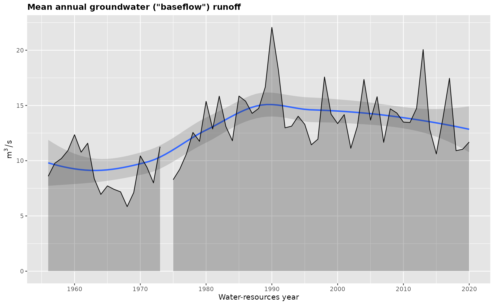

``` r

# plot one selected variable
gr_plot_vars(vars, Dspstart) 
#> Warning: Removed 1 row containing non-finite outside the scale range
#> (`stat_smooth()`).
#> Warning: Removed 1 row containing missing values or values outside the scale range
#> (`geom_point()`).
```

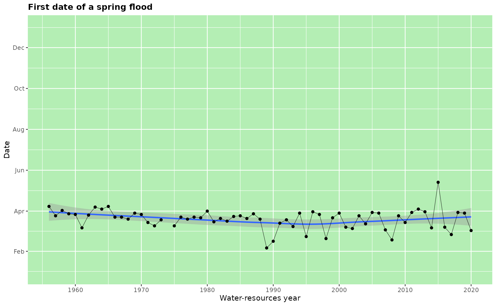

``` r

# plot two variables sequentially
gr_plot_vars(vars, D10w1, Wsprngr)
#> Warning: Removed 1 row containing non-finite outside the scale range (`stat_smooth()`).
#> Removed 1 row containing missing values or values outside the scale range
#> (`geom_point()`).
```

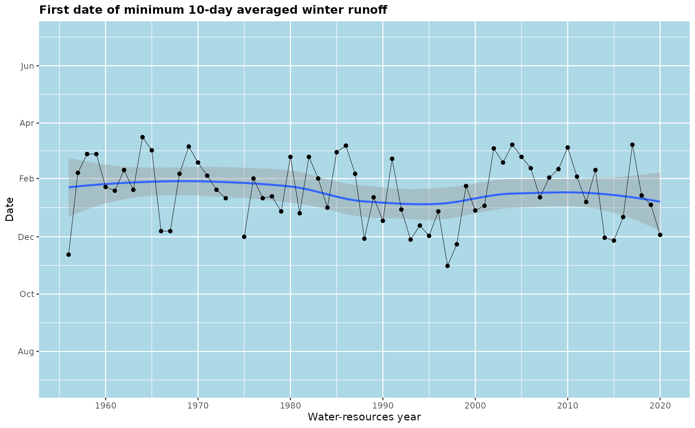

    #> Warning: Removed 1 row containing non-finite outside the scale range
    #> (`stat_smooth()`).
    #> Warning: Removed 1 row containing missing values or values outside the scale range
    #> (`geom_ribbon()`).

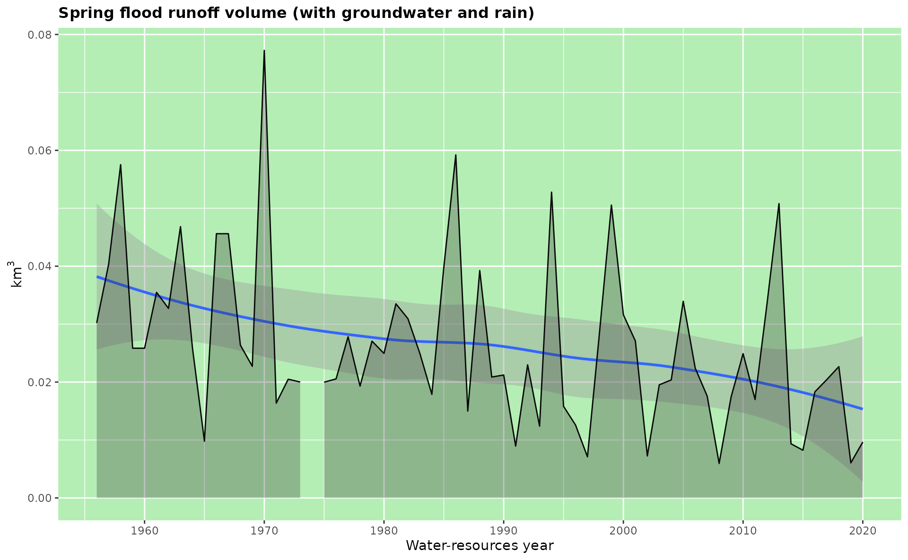

``` r

# plot four variables in matrix layout
gr_plot_vars(vars, Qspmax, Qygr, D10w1, Wsprngr,
             layout = matrix(1:4, nrow = 2, byrow = TRUE)) 
#> Warning: Removed 1 row containing non-finite outside the scale range (`stat_smooth()`).
#> Removed 1 row containing missing values or values outside the scale range
#> (`geom_ribbon()`).
#> Warning: Removed 1 row containing non-finite outside the scale range
#> (`stat_smooth()`).
#> Warning: Removed 1 row containing missing values or values outside the scale range
#> (`geom_ribbon()`).
#> Warning: Removed 1 row containing non-finite outside the scale range
#> (`stat_smooth()`).
#> Warning: Removed 1 row containing missing values or values outside the scale range
#> (`geom_point()`).
#> Warning: Removed 1 row containing non-finite outside the scale range
#> (`stat_smooth()`).
#> Warning: Removed 1 row containing missing values or values outside the scale range
#> (`geom_ribbon()`).
```

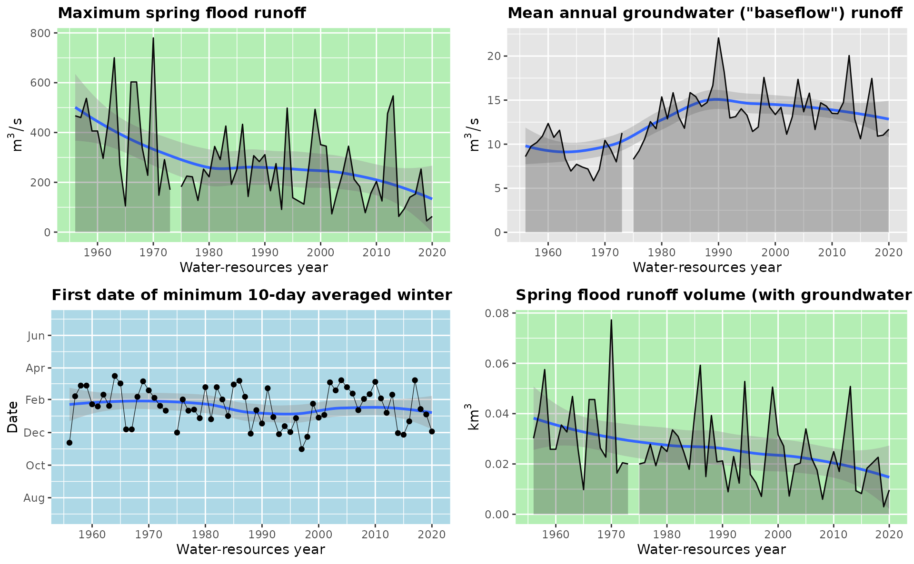

Tests can be calculated on the fly during the variable plotting or
passed into `tests =` parameters. In this case the plots are
supplemented with trend line and change year:

``` r
# add tests calculated on the fly (only plotted variables are tested)
gr_plot_vars(vars, Qspmax, Qygr, D10w1, Wsprngr,
             layout = matrix(1:4, nrow = 2, byrow = TRUE),
             tests = TRUE) 
#> Warning: Removed 1 row containing non-finite outside the scale range
#> (`stat_smooth()`).
#> Warning: Removed 1 row containing missing values or values outside the scale range
#> (`geom_ribbon()`).
#> Warning: Removed 1 row containing non-finite outside the scale range
#> (`stat_smooth()`).
#> Warning: Removed 1 row containing missing values or values outside the scale range
#> (`geom_ribbon()`).
#> Warning: Removed 1 row containing non-finite outside the scale range
#> (`stat_smooth()`).
#> Warning: Removed 1 row containing missing values or values outside the scale range
#> (`geom_point()`).
#> Warning: Removed 1 row containing non-finite outside the scale range
#> (`stat_smooth()`).
#> Warning: Removed 1 row containing missing values or values outside the scale range
#> (`geom_ribbon()`).
```

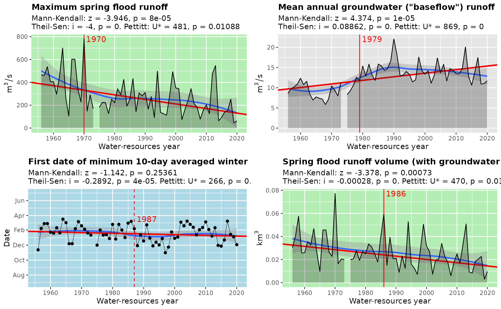

``` r

# calculate tests beforehand
tests = gr_test_vars(vars)
gr_plot_vars(vars, D10w1, Wsprngr, Nthw, Qrnmax,
             layout = matrix(1:4, nrow = 2, byrow = TRUE),
             tests = tests) 
#> Warning: Removed 1 row containing non-finite outside the scale range
#> (`stat_smooth()`).
#> Warning: Removed 1 row containing missing values or values outside the scale range
#> (`geom_point()`).
#> Warning: Removed 1 row containing non-finite outside the scale range
#> (`stat_smooth()`).
#> Warning: Removed 1 row containing missing values or values outside the scale range
#> (`geom_ribbon()`).
#> Warning: Removed 1 row containing non-finite outside the scale range (`stat_smooth()`).
#> Removed 1 row containing non-finite outside the scale range (`stat_smooth()`).
#> Warning: Removed 1 row containing missing values or values outside the scale range
#> (`geom_ribbon()`).
```

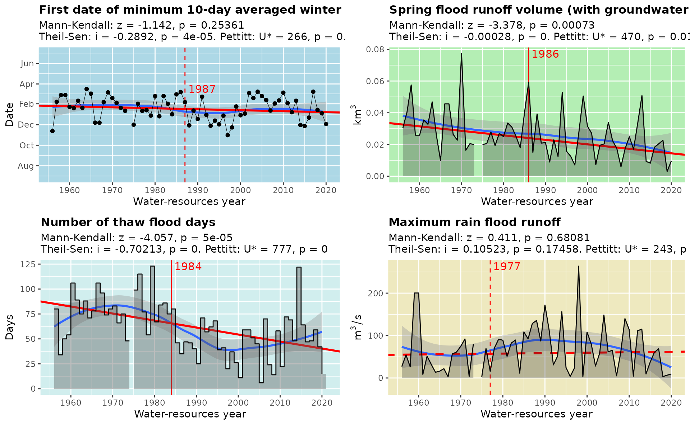

## Period plots

Period plots are boxplots produced by
[`gr_plot_periods()`](../reference/gr_plot_periods.md) for hydrograph
separation variables. The data for each variable is divided into two
sample periods: before and after the change year either set by `year`
parameter or extracted from `tests` (statistically estimated). Different
background fill colors are used to differentiate seasons:

``` r
# plot periods with fixed change year
gr_plot_periods(vars, Qygr, year = 1979)
#> Warning: Removed 1 row containing non-finite outside the scale range
#> (`stat_boxplot()`).
```

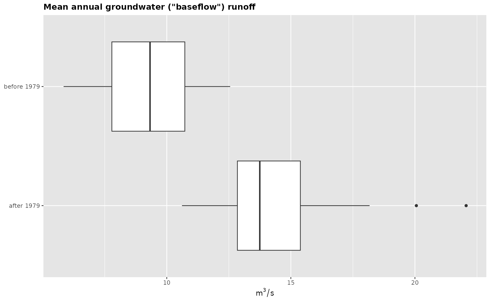

``` r

# plot periods with change year from Pettitt test
gr_plot_periods(vars, Qygr, tests = TRUE)
#> Warning: Removed 1 row containing non-finite outside the scale range
#> (`stat_boxplot()`).
```

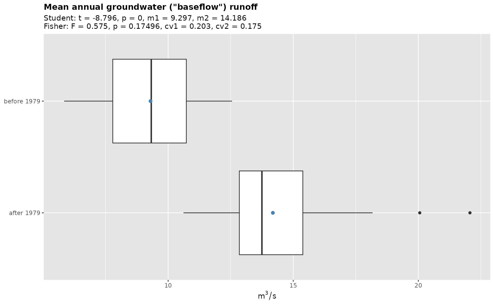

``` r

# calculate test beforehand
gr_plot_periods(vars, Qspmax, tests = tests)
#> Warning: Removed 1 row containing non-finite outside the scale range
#> (`stat_boxplot()`).
```

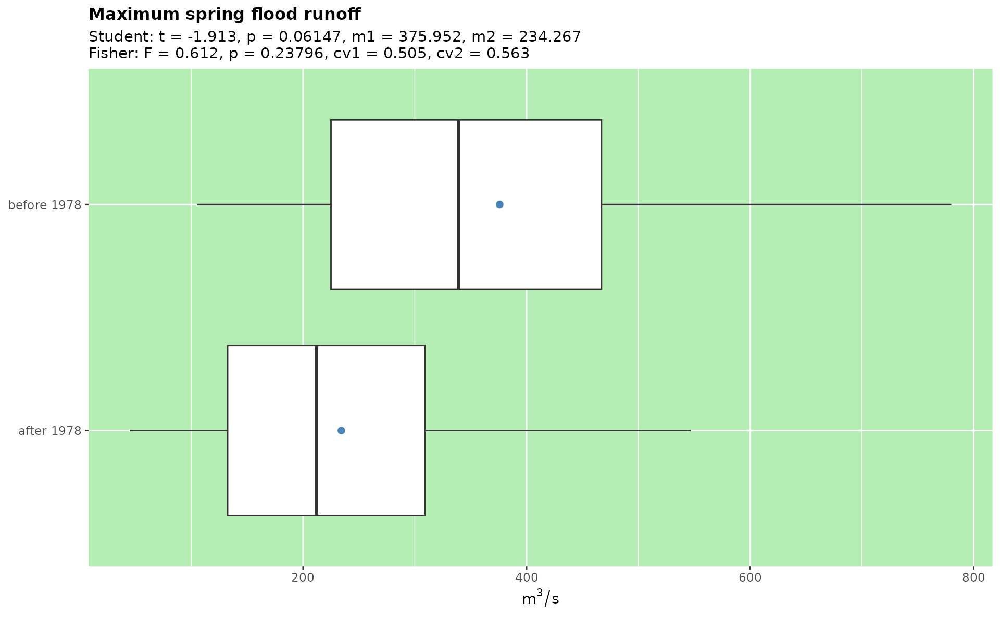

``` r

# use matrix layout to plot multiple variables
gr_plot_periods(vars, Qygr, Qspmax, D10w1, Wsprngr,
                layout = matrix(1:4, nrow = 2),
                tests = tests)
#> Warning: Removed 1 row containing non-finite outside the scale range (`stat_boxplot()`).
#> Removed 1 row containing non-finite outside the scale range (`stat_boxplot()`).
#> Removed 1 row containing non-finite outside the scale range (`stat_boxplot()`).
#> Removed 1 row containing non-finite outside the scale range (`stat_boxplot()`).
```

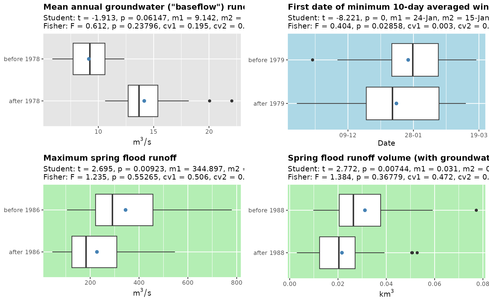

## Minimum runoff month plots

A histogram of a minimum runoff month for two periods: before and after
the change year set by `year` parameter. This kind of plot is produced
by [`gr_plot_minmonth()`](../reference/gr_plot_minmonth.md):

``` r
# plot minimum runoff month for two periods divided by Pettitt test
gr_plot_minmonth(vars, tests = gr_test_vars(vars))
```

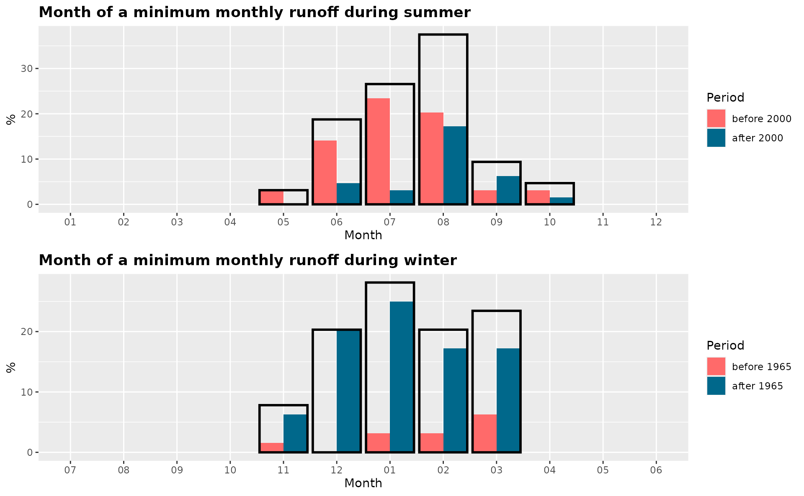

``` r

# plot minimum runoff month for two periods divided by fixed year
gr_plot_minmonth(vars, year = 1979)
```

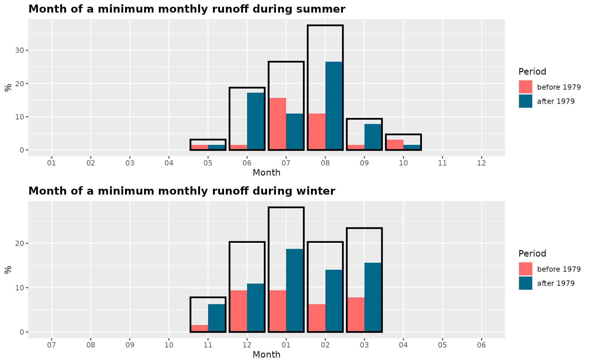

## Test plots

Test plots produced by
[`gr_plot_tests()`](../reference/gr_plot_tests.md) are intended to
facilitate the visual analysis of statistical tests. Currently only the
change year density is available as a plotting variable:

``` r
# plot change year from Pettitt test
gr_plot_tests(tests, type = 'year')
```

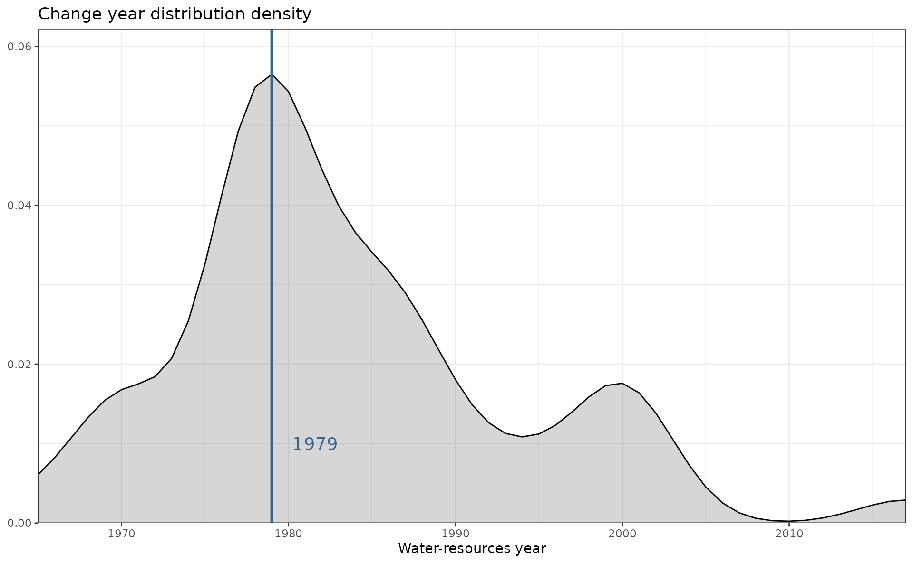

As can be seen from this plot, most of the variables demonstrate the
change in their statistical behavior around $1979$ year.
