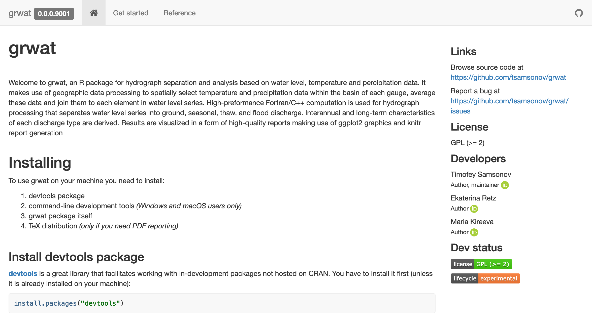
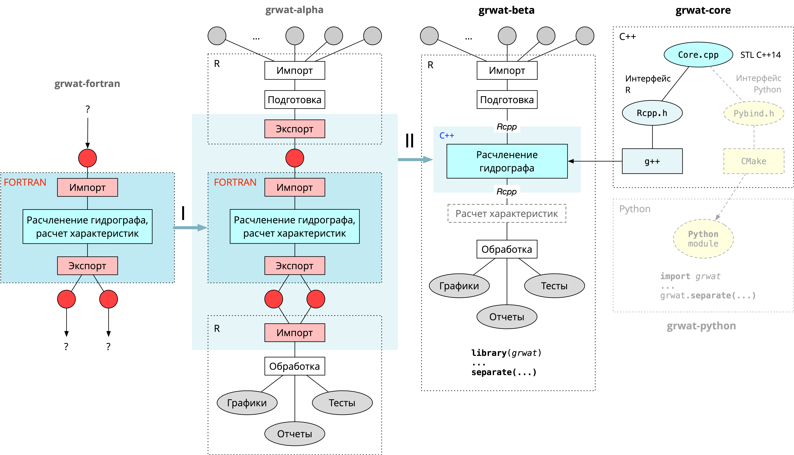

```{r setup, include=FALSE}
knitr::opts_chunk$set(echo = FALSE, warning = FALSE, message = FALSE)
library(tidyverse)
library(knitr)
library(kableExtra)
library(DiagrammeR)

pkg_ref <- function(name) {
  tools::Rd_db("grwat") %>% 
    lapply(function(f) {
      c(unlist(f[[2]][[1]][[1]]), unlist(f[[1]][[1]][[1]]))
    }) %>% 
    unname() %>% 
    unlist() %>% 
    matrix(ncol = 2, byrow = TRUE) %>% 
    as_tibble() %>% 
    rename(Function = 1, Description = 2) %>% 
    mutate(Function = paste0(Function, '()'))
}
```

## Пакет grwat

[https://tsamsonov.github.io/grwat](https://tsamsonov.github.io/grwat)



---

## Текущая функциональность

```{r}
pkg_ref('grwat') %>% 
  mutate(Function = cell_spec(Function, 'html', color = 'steelblue')) %>% 
  knitr::kable(format = 'html', escape = FALSE)
```

---

### Миграция рабочего процесса


---

### План работ на первый год

1. [__из заявки на 1-й год__] Переписать основной программный алгоритм расчленения гидрографа со сложно интерпретируемого языка Fortran на язык С++, позволяющий легко интегрировать его в виде функции в общую структуру кода на языке R. По итогу работы будет получен основной блок программы, в виде отдельной функции. 

2. [__из заявки на 2-й год__] Провести усовершенствование функций первичной обработки входных данных и визуализации результатов работы пакета: 
  - стандартизация формата входных данных блока рачленения
  - фильтрация входных и "расчлененных" данных (для тестов)
  - драйвера для чтения популярных реанализов
  - оперативные доработки функционала и исправление ошибок

> __Статьи__ в качестве основного автора _не планируются_
> __Командировки__ _не планируются_
