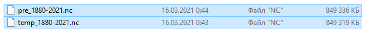

```{r setup, include = FALSE}
knitr::opts_chunk$set(
  collapse = TRUE,
  comment = "#>"
)

knitr::opts_chunk$set(fig.width = 10, fig.height = 7, out.width = '100%', dpi = 300, collapse = TRUE)
Sys.setlocale("LC_TIME", "en_US.UTF-8")
```

# Read and preprocess the source data

## Read raw discharge data

The starting point for hydrograph analysis is to obtain the source data. Let's see how it goes with sample `spas-zagorye.txt` discharge data for $1956-2020$ year range provided with grwat. This data is for [Spas-Zagorye](https://allrivers.info/gauge/protva-obninsk) gauge on [Protva](https://en.wikipedia.org/wiki/Protva) river in Central European plane:

```{r, message=FALSE, warning=FALSE}
library(sf) # reading and manipulating spatial data
library(tidyverse) # general data wrangling
library(mapview) # interactive mapping of spatial data
library(grwat)

mapviewOptions(fgb = FALSE)

# this is path to sample data installed with grwat
path = system.file("extdata", "spas-zagorye.txt", 
                   package = "grwat")

# for your own data just provide the full path:
# path = /this/is/the/path/to/discharge/discharge.csv

hdata_raw = read_delim(path, 
                   col_names = c('d', 'm', 'y', 'q'), 
                   col_types = 'iiid', delim = ' ') # read gauge data
head(hdata_raw) # see the data
```

`grwat` expects the date as a *single* column. Therefore, in this case we have to construct it manually. For this it is convenient to use `make_date()` function from `lubridate` package:

```{r}
hdata = hdata_raw %>% 
  transmute(Date = lubridate::make_date(y, m, d), 
            Q = q)
head(hdata)
```

> The basic data structure for grwat separation function is a data frame (or tibble) with two columns: date (first column) and discharge (second column). The columns can have any names, not necessarily `D` and `Q`.

## Fill gaps {#fill}

Hydrograph data may contain empty values due to corrupted records or missed observations at specific dates. A short summary of gap periods can be obtained by `gr_get_gaps()` function:

```{r}
gaps = gr_get_gaps(hdata)
gaps
```

`gr_fill_gaps()` function allows filling gaps in the data. This function first expands the date sequence if some dates are missing between the minimum and the maximum date in the table, and then trims the sequence of dates if missing obervations are at the beginning or end of the sequence. After expansion all missing observations are filled by linear interpolation between nearest values.

You can limit the maximum gap extent by threshold autocorrelation value (`autocorr` parameter) or expliсit number of observations (`nobserv` parameter):

```{r}
fhdata = gr_fill_gaps(hdata, autocorr = 0.7)
fhdata = gr_fill_gaps(hdata, nobserv = 10)
```

How the time window is computed in the first case? When the `autocorr` parameter is used, the ACF (autocorrelation function) is computed first, and then its values are used to obtain the time shift (in days) during which the autocorrelation is higher or equal to the specified value. For Spas-Zagorye data the time lag for $ACF \geq 0.7$ is 6 days, which can be inferred by `gr_plot_acf()` function:

```{r}
gr_plot_acf(hdata, 0.5)
```

## Join meteorological variables

A sole discharge data is enough to separate the hydrograph into quickflow and baseflow, but is not sufficient to predict the genesis of quickflow cases. Was it due to rain or thaw? To answer such questions you also need precipitation and temperature data. Ideally, these must be measured at the gauge. But often such data is not available. In this case you need to mine this data from external sources.

One of the ways to obtain the temperature and precipitation data is to use reanalyses such as [ERA5](https://www.ecmwf.int/en/forecasts/datasets/reanalysis-datasets/era5). Reanalysis data is arranged as regular grids with specific resolution. In particular, the ERA5 data has $31$ km or $0.28125$ degrees resolution. To use such data you must tolerate the fact that none of the reanalysis grid nodes will coincide with your gauge. Instead, you have to use the data, which is either

-   the closest reanalysis point
-   all points falling within the buffer zone of the gauge
-   all points falling within the basin of the the gauge.
-   all points falling within the buffer zone of the basin of the the gauge.

The last two options are the most adequate. Let's see how it can be done.

### Basin, buffered basin or buffered gauge

First, we need to read the basin spatial data:

```{r, dpi = 72}
# this is path to sample basin geopackage installed with grwat
path = system.file("extdata", "spas-zagorye.gpkg", package = "grwat")

# for your own data just provide the full path:
# path = /this/is/the/path/to/discharge/basin.shp

basin = st_read(path, layer = 'basin') # read basin region
gauge = st_read(path, layer = 'gauge') # read gauge point
mapview(basin) + mapview(gauge)
```

Next, we can buffer the data on the specified distance to catch more reanalysis data. For this we use `gr_buffer_geo` function, which approximates geographic buffer of the specified radius:

```{r, dpi = 72}
basin_buffer = gr_buffer_geo(basin, 25000) 
mapview(basin_buffer, col.regions = 'red') +
  mapview(basin)

g = basin

box = sf::st_bbox(g)
  lon0 = 0.5 * (box[1] + box[3]) # longitude
  lat0 = 0.5 * (box[2] + box[4]) # latitude
  prj = stringr::str_interp('+proj=aeqd +lat_0=${lat0} +lon_0=${lon0} +x_0=0 +y_0=0 +datum=WGS84')
  
  g %>% 
    sf::st_transform(crs = prj) %>% 
    sf::st_buffer(25000) %>% 
    sf::st_transform(4326)
```

Alternatively you can just buffer the gauge point, though it is less meaningful since you will grab reanalysis data that falls out of gauge's basin:

```{r, dpi = 72}
gauge_buffer = gr_buffer_geo(gauge, 50000) 
mapview(gauge_buffer, col.regions = 'red') +
  mapview(gauge)
```

### Joining the East-European Plane reanalysis

**grwat** is packaged with daily reanalysis which covers the East European territory of Russia. It has a spatial resolution of $0.75^{\circ} \times 0.75^{\circ}$, and temporal resolution of $1$ (one) day. Data sources include:

-   [CIRES-DOE](https://psl.noaa.gov/data/gridded/data.20thC_ReanV3.html) from 01-01-1880 till 31-12-1978
-   [ERA5](https://www.ecmwf.int/en/forecasts/datasets/reanalysis-datasets/era5) from 01-01-1979 till now.

The coverage of the reanalysis is shown below:

```{r, echo=FALSE, out.width='50%'}
knitr::include_graphics('img/reanalysis.png')
```

The reanalysis consists of two data files, each file is about 850 Mb in size:

```{r, echo=FALSE}

```

Download this data using the [**link**](http://carto.geogr.msu.ru/grwat/) for using with grwat.

```{r}
rean = gr_read_rean(
  '/Volumes/Data/Spatial/Reanalysis/grwat/pre_1880-2021.nc',
  '/Volumes/Data/Spatial/Reanalysis/grwat/temp_1880-2021.nc'
) # read reanalysis data

fhdata_rean = gr_join_rean(fhdata, rean, basin_buffer) # join reanalysis data to hydrological series

head(fhdata_rean)
```

After reanalysis data are joined you can easily plot a map of the derived spatial configuration:

```{r, dpi = 72}
 # plot spatial configuration
m = mapview(basin_buffer, col.regions = 'red') +
  mapview(basin) +
  mapview(rean$pts[basin_buffer, ], col.regions = 'black') +
  mapview(rean$pts, cex = 1)

box = st_bbox(basin_buffer)
center = st_coordinates(st_centroid(basin_buffer))

m@map %>% leaflet::setView(center[1], center[2], zoom = 7)
```

### Joining the ERA5 reanalysis

> To be described

<!-- ERA 5 data can be accessed via [__`ecmwfr`__](https://bluegreen-labs.github.io/ecmwfr/index.html) package. Before you access the data, you must register and obtain the Climate Data Store (CDS) API key. Please follow instructions [here](https://bluegreen-labs.github.io/ecmwfr/index.html#use-copernicus-climate-data-store-cds). -->

<!-- First, set your key: -->

<!-- ```{r, eval=F} -->

<!-- wf_set_key(user = "12345", -->

<!--            key = "XXXXXXXXXXXXXXXXXXXXXX", -->

<!--            service = "cds") -->

<!-- ``` -->

<!-- ```{r, echo=FALSE, include=FALSE} -->

<!-- wf_set_key(user = "87659", -->

<!--            key = "df251cc6-5b0b-4100-b2ee-617fcea66b04", -->

<!--            service = "cds") -->

<!-- ``` -->

<!-- Second, fill the request list: -->

<!-- ```{r} -->

<!-- # This is an example of a request for # downloading 'ERA-5' reanalysis data for -->

<!-- # 2000-04-04 00:00 UTC, temperature on # 850 hectopascal for an area covering  -->

<!-- # northern Europe. -->

<!-- # File will be stored as "era5-demo.nc" (netcdf format). -->

<!-- request = list("dataset_short_name" = "reanalysis-era5-single-levels", -->

<!--                 "product_type" = "reanalysis", -->

<!--                 "variable" = c("temperature", "total_precipitation"), -->

<!--                 "year" = '2020', -->

<!--                 "month" = '01', -->

<!--                 "day" = '01', -->

<!--                 "time" = '00:00', #seq(0, 21, by = 3), -->

<!--                 # "area" = as.vector(box), -->

<!--                 "area" = "70/-20/00/60", -->

<!--                 "format" = "netcdf", -->

<!--                 "target" = "era5.nc") -->

<!-- request <- list("dataset_short_name" = "reanalysis-era5-pressure-levels", -->

<!--                 "product_type" = "reanalysis", -->

<!--                 "variable" = "temperature", -->

<!--                 "pressure_level" = "850", -->

<!--                 "year" = "2000", -->

<!--                 "month" = "04", -->

<!--                 "day" = "04", -->

<!--                 "time" = "00:00", -->

<!--                 "area" = "70/-20/00/60", -->

<!--                 "format" = "netcdf", -->

<!--                 "target" = "era5-demo.nc") -->

<!-- ``` -->

<!-- Then pass it to the [`wf_request()`](https://bluegreen-labs.github.io/ecmwfr/reference/wf_request.html) function -->

<!-- ```{r, eval=F} -->

<!-- file = wf_request(user     = "12345",   # user ID (for authentification) -->

<!--                    request  = request,  # the request -->

<!--                    transfer = TRUE,     # download the file -->

<!--                    path     = ".")      # store data in current working directory -->

<!-- ``` -->

<!-- ```{r, include=F, echo=F} -->

<!-- file = wf_request(user     = "87659",   # user ID (for authentification) -->

<!--                   request  = request,  # the request -->

<!--                   transfer = TRUE,     # download the file -->

<!--                   path     = ".")      # store data in current working directory -->

<!-- ``` -->

# Separate and summarize {#separate}

## Basic separation: quickflow and baseflow {#separate-basic}

The basic separation procedure is provided by `get_baseflow()` function. One of the most commonly used approaches is the method by Lyne-Hollick (1979):

```{r}
resbase = fhdata %>% 
  mutate(Qbase = gr_baseflow(Q, method = 'lynehollick'))

# quick look at the table
head(resbase, 10)
  
resbase %>% 
  filter(lubridate::year(Date) == 2020) %>% 
  ggplot() +
    geom_area(aes(Date, Q), fill = 'steelblue', 
              color = 'black') +
    geom_area(aes(Date, Qbase), fill = 'orangered', 
              color = 'black')
```

The separation is mainly parameterized by smoothing parameter which is `a = 0.925` by default, and number of passes, which are `passes = 3` by default. Changing them affects the shape of a baseflow component:

```{r}
resbase = fhdata %>% 
  mutate(Qbase = gr_baseflow(Q, method = 'lynehollick', 
                             a = 0.8, passes = 5))
  
resbase %>% 
  filter(lubridate::year(Date) == 2020) %>% 
  ggplot() +
    geom_area(aes(Date, Q), fill = 'steelblue', 
              color = 'black') +
    geom_area(aes(Date, Qbase), fill = 'orangered', 
              color = 'black')
```

Let's see how different separation methods act in comparison to each other:

```{r, fig.height = 12}
methods = c("maxwell",
            "boughton",
            "jakeman",
            "lynehollick",
            "chapman")

plots = lapply(methods, function(m) {
  resbase = fhdata %>% 
    mutate(Qbase = gr_baseflow(Q, method = m))

  resbase %>%
    filter(lubridate::year(Date) == 2020) %>% 
    ggplot() +
      geom_area(aes(Date, Q), fill = 'steelblue', color = 'black') +
      geom_area(aes(Date, Qbase), fill = 'orangered', color = 'black') +
      labs(title = m)
})

patchwork::wrap_plots(plots, ncol = 2)
```

## Advanced separation: genetic components {#separate-advanced}

Advanced separation aims at revealing the genesis of the quickflow. Was it due to a rain or snowmelting? For this, a joint analysis of discharge, temperature and precipitation time series is performed by specialized algorithm, available from `gr_separate()` function in grwat package.

The genetic separation of hydrograph is controlled by more than 30 parameters. The names and meaning of these parameters can be learned thanks to `gr_help_params()` function:

```{r}
View(gr_help_params())
```

Since the number of parameters is large (31), they are organized as list, which is then fed into `gr_separate()` function. First, you get the params using the `gr_get_params()` function. The only parameter of the function is `reg`, which indicates the region for which the parameters must be extracted. After you got the parameters, they can be changed by accessing the list elements:

```{r}
# Расчленение
p = gr_get_params(reg = 'Midplain')
p$precdays = 5
p$ftrecdays = 85
```

Next, you can separate the hydrograph:

```{r}
sep = gr_separate(fhdata_rean, p)
head(sep)
```

After the hydrograph is separated, it can be summarized in a set of variables:

```{r, message=FALSE, warning=FALSE}
vars = gr_summarize(sep)
head(vars)
```

# Plot and test

These functions from grwat package allow you to:

-   Plot separation of hydrograph
-   Plot interannual changes of key water discharge variables
-   Plot long-term changes of key water discharge variables
-   Perform statistical tests on all calculated variables

Graphical functions are based on [ggplot2](https://ggplot2.tidyverse.org) graphics.

## Plot separation of hydrograph

You can plot separations for selected years using `gr_plot_sep()` function:

```{r, fig.width=12, fig.height=6}
gr_plot_sep(sep, 1976) # plot single year
gr_plot_sep(sep, c(2016, 2017)) # plot two years sequentially
```

And also multiple years on the same layout:

```{r fig.width=12, fig.height=12}
gr_plot_sep(sep, 1976:1979, # plot four years on the same page
            layout = matrix(c(1,2,3,4), ncol=2, byrow = T))
```

## Interannual change variables

To get the detailed description of available variables you can invoke `gr_help_vars()`:

```{r}
View(gr_help_vars())
```

Parameters can be statistically tested using `test_variables(df, ..., year = NULL, locale='EN')` function. Names of the parameters are passed comma-separated in place of `...`. They are quoted, so you do not need to pass them as character strings, just write their names:

```{r}
gr_test_vars(vars, Qmax)
```

This is an example with three variables selected:

```{r}
tests = gr_test_vars(vars, Qygr, date10w1, Wpol3)
tests$pvalues
```

If you want to test all parameters, just skip variable names:

```{r}
tests = gr_test_vars(vars)
tests$year # this is a change year detected for each variable
```

Long-term changes are tested against breaking year, which is calculated for each variable using Pettitt test. However, if you want to use a fixed year, you should pass the desired breaking year into `change_year` parameter:

```{r}
tests = gr_test_vars(vars, Qmax, Qygr, change_year = 1987)
tests$ft # Fisher F tests to compare two variances
```

## Plot interannual changes

Interannual changes are visualized using `gr_plot_vars()` function. Its syntax is similar to `gr_test_vars()` and `gr_plot_sep()`:

```{r, fig.width=12, fig.height=6}
gr_plot_vars(vars, Qmax) # plot one selected variable
gr_plot_vars(vars, datestart) # plot one selected variable
gr_plot_vars(vars, date10w1, Wpol3) # plot two variables sequentially
```

```{r, fig.width=12, fig.height=12}

gr_plot_vars(vars, Qmax, Qygr, date10w1, Wpol3, # plot four variables in matrix layout
             layout = matrix(c(1,2,3,4), nrow=2, byrow=TRUE)) 
```

You can add the results of statistical tests to the plot by specifying `tests = TRUE` in the function call. In that case the subtitle with test results are added, Theil-Sen slope and Pettitt test breaking year are drawn as solid ($p \leq 0.05$) or dashed ($p > 0.05$) lines:

```{r, fig.width=12, fig.height=6}
gr_plot_vars(vars, date10w1, Wpol3, DaysThawWin, Qmaxpavs,
             tests = TRUE) # add test information
```

Alternatively, you can pass to `tests` the result of `test_variables()`, if you need to precompute it with specific parameters (for example, by setting `exclude` and `year`:

```{r, eval = FALSE}
gr_plot_vars(vars, date10w1, Wpol3, DaysThawWin, Qmaxpavs,
             tests = gr_test_vars(vars, date10w1, Wpol3, DaysThawWin, Qmaxpavs, exclude = 1990)) # add test information
```

Beware that in that case you should test the variables *in the same order as used for plotting*. If you plot variables A, B, C and supply tests for variables X, Y, Z, they will be added without any warnings, and it is your responsibility to keep them in correspondence with each other.

Finally, you can plot *all variables* by not supplying column names to `plot_variables()` function. In that case tests (if you want to plot them too) should also be calculated for all variables:

```{r, eval=FALSE}
gr_plot_vars(vars, tests = TRUE)
```

## Plot long-term period changes

Long-term changes are the differences between summarized statistics of one variable calculated for two selected periods. Because these statistics reflect the differences in distributions of parameters, grwat visualizes them as box plots using `gr_plot_periods()` function. The syntax is similar to `gr_plot_vars()` except that you must provide either `tests` or `year` parameter. If both are supplied then `tests` is prioritized (you can also supply a fixed year when testing variables:

```{r, fig.height = 2.5}
gr_plot_periods(vars, Qy, year = 1978)
gr_plot_periods(vars, Qy, tests = TRUE)
gr_plot_periods(vars, Qy, tests = gr_test_vars(vars, Qy, year = 1985))
```

Multiple plots can be combined on one page using `layout` parameter:

```{r, fig.width=12, fig.height=8}
gr_plot_periods(vars, Qy, Qmax, date10w1, Wpol3,
                tests = TRUE,
                layout = matrix(1:4, nrow = 2))
```

To plot long-term changes for all variables just skip variable names in function call:

```{r, eval = FALSE}
gr_plot_periods(vars, tests = TRUE)
```

There is also a small helper function that plots a histogram of minimal discharge month for summer and winter periods:

```{r, fig.height= 12, message=FALSE}
gr_plot_minmonth(vars, year = 1985)
```

## Plot discharge parameters

There is a dedicated `gr_plot_matrix()` function that plot the whole time series in a convenient matrix form. Currently it supports plotting the runoff, season and component:

```{r, fig.width=10, fig.height=5}
gr_plot_matrix(sep, type = 'runoff')
gr_plot_matrix(sep, type = 'season')
gr_plot_matrix(sep, type = 'component')
```

You can also limit the range of years that will be plotted:

```{r, fig.width=10, fig.height=2.5}
gr_plot_matrix(sep, years = 1980:1995, type = 'component')
```

# Hydrograph comparisons

Sometimes you want to compare hydrographs for selected years. There are multiple ways to do so in R. Here we will explore three of those: overlayed, ridgeline and horiaon plots. Since these require a small number of manipulations via existing R packages, there is no dedicated functionality for this in **`grwat`**.

## Overlayed

The simplest (but not necessarily most effective) way to compare multiple hydrographs is to just to combine them on one plot:

```{r, fig.width=8, fig.height=4}
library(ggplot2)
library(lubridate)

sep_sel = sep |> 
  filter(Year %in% c(1989, 2012))

ggplot(sep_sel, aes(ymd(20000101) + yday(Date), Q, 
                    fill = factor(Year), group = factor(Year))) + 
  geom_area(alpha = 0.8, position = "identity") +
  geom_line() +
  scale_x_date(date_labels = "%b", date_breaks = "1 month") +
  theme_minimal() +
  labs(x = 'Date', y = 'Discharge', fill = 'Year')
```

It can be seen that even in the case of two hydrographs the plot is not easy to read. It becomes nearly impossible if we increase the number of years:

```{r, fig.width=8, fig.height=4}
sep_sel = sep |> 
  filter(Year %in% c(1960, 1965, 1989, 2001, 2012))

ggplot(sep_sel, aes(ymd(20000101) + yday(Date), Q, 
                    fill = factor(Year), group = factor(Year))) + 
  geom_area(alpha = 0.8, position = "identity") +
  geom_line() +
  scale_x_date(date_labels = "%b", date_breaks = "1 month") +
  theme_minimal() +
  labs(x = 'Date', y = 'Year')
```

## Ridgeline

If we are interested more in the shape and relative dimensions of the hydrographs, and do not want the exact Y axis, then we can proceed with ridgeline plots available at [**`ggridges`**](https://wilkelab.org/ggridges/) package. **`grwat`** contains a convenient wrapper called `gr_plot_ridge()`:

```{r, fig.width=10, fig.height=5}
gr_plot_ridge(sep, years = c(1960, 1965, 1989, 2001, 2012))
```

## Horizon

Another alternative to the ridgeline plot is the horizon plot, which can be built by [**`ggHoriPlot`**](https://rivasiker.github.io/ggHoriPlot/) package. Horizon plots are more compact and allow viewing more hydrographs at once. **grwat** contains a convenient wrapper called `gr_plot_hori()`:

```{r, fig.width=8, fig.height=4}
gr_plot_hori(sep, years = 1960:1980)
```

# Reports

To render HTML report just pass separation and variables to `gr_report()` function, and provide the output file name:

```{r, eval = FALSE}
report = '~/Spas-Zagorye.html'
gr_report(sep, vars, output = report)
browseURL(report)
```

See [report](https://tsamsonov.github.io/grwat/articles/Spas-Zagorye.html) generated by this command.
